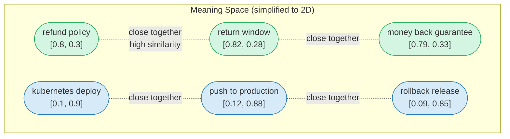
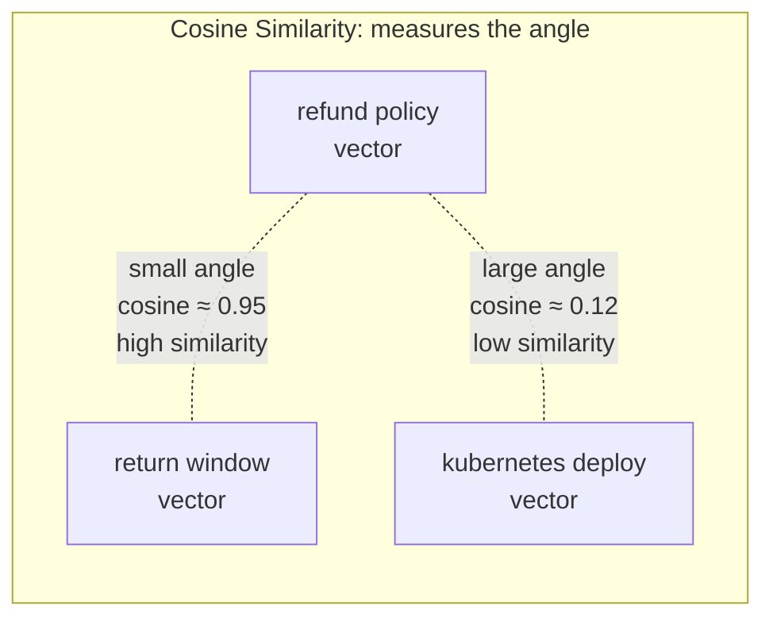
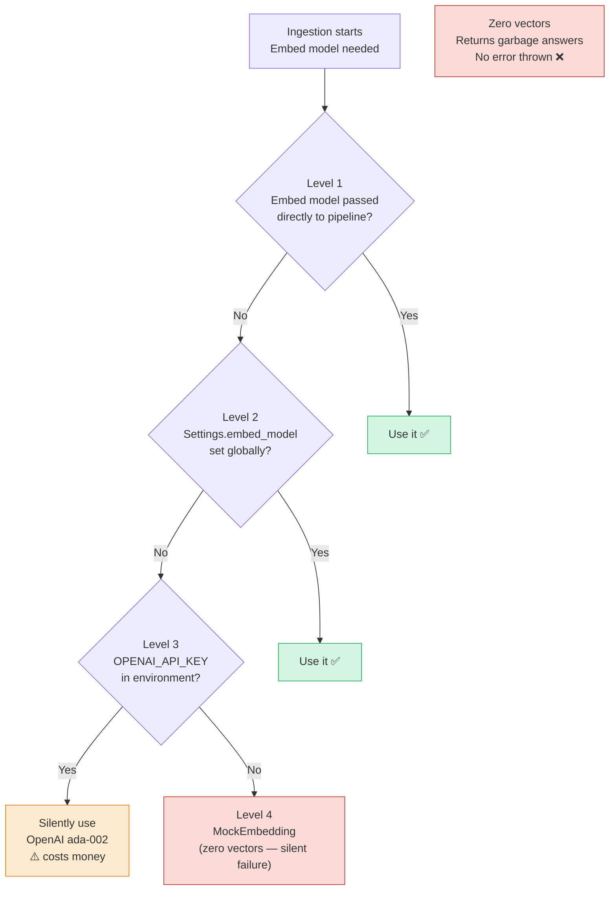
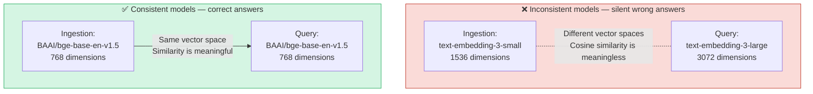
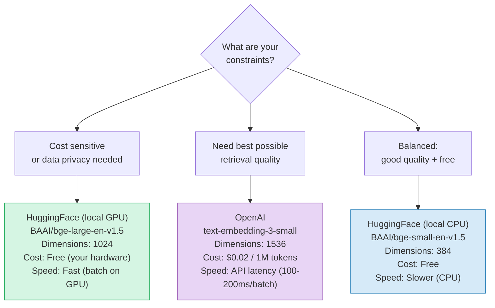
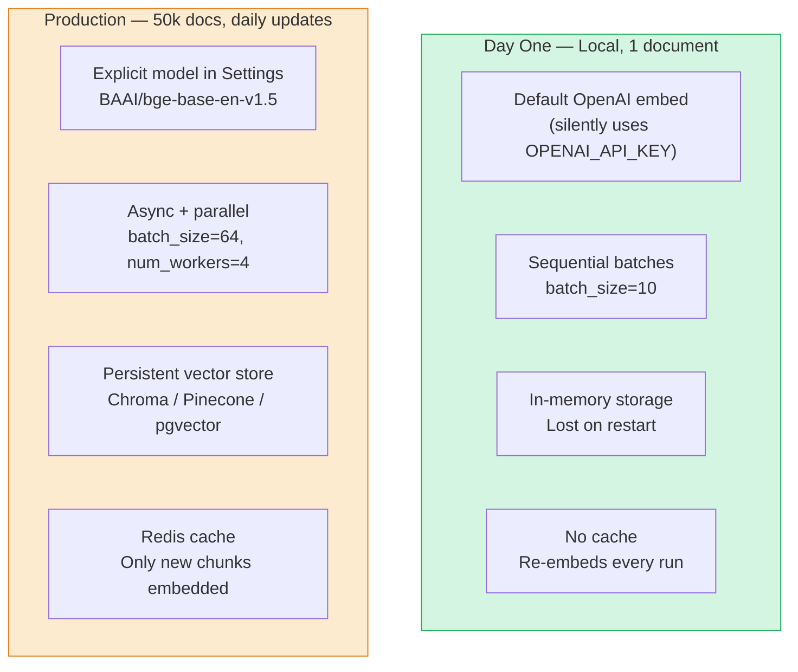

# Chapter 4: Embeddings — Giving Text a Location in Meaning-Space

> **Series:** Building a Production RAG System with LlamaIndex  
> **Usecase:** You have 650,000 chunks from your company wiki. To search them by meaning — not just keywords — each chunk needs to be converted into a vector of numbers that captures what it is *about*.

---

## The problem this chapter solves

You have 650,000 text chunks. A user asks: *"How do I roll back a failed deployment?"*

You cannot do a keyword search — the answer might say "revert to previous release" or "undo the push" or "restore the last stable image". None of those match the words "roll back". You need search that understands **meaning**, not just letters.

Embeddings solve this. Every chunk of text gets converted into a list of numbers — a vector — that represents its meaning geometrically. Text that means similar things ends up with similar vectors. Text about different topics ends up with different vectors.



In reality, vectors have 1536 dimensions (not 2). But the principle is the same: semantically similar text clusters together in this high-dimensional space. Search becomes: *"find the vectors closest to my query vector"*.

---

## What an embedding model does

An embedding model is a neural network trained to read text and output a fixed-size list of floats. The model has seen billions of text pairs and learned which passages are semantically related. By training time, it has encoded the structure of language into its weights.

When you pass `"refund policy"` to an embedding model, it returns something like:

```python
[0.023, -0.891, 0.442, 0.103, -0.234, ..., 0.671]  # 1536 numbers
```

Every number encodes a latent dimension of meaning. No single dimension maps to a human concept like "refund" or "return" — the meaning is distributed across all 1536 numbers together. The model learns this representation automatically during training.

The critical property: **the angle between two vectors measures semantic similarity**. Vectors pointing in the same direction = similar meaning. Vectors pointing in opposite directions = opposite meaning. Perpendicular vectors = unrelated topics.

This is why the similarity metric is called **cosine similarity** — it measures the cosine of the angle between two vectors.



---

## The `BaseEmbedding` interface

Every embedding model in LlamaIndex — whether it is OpenAI, HuggingFace, Cohere, or a custom local model — implements the same interface. This is what makes them swappable without changing any other code.

```python
class BaseEmbedding(BaseComponent):
    model_name:       str
    embed_batch_size: int   # how many texts to embed in one API call

    # Used during ingestion — embed each chunk
    def get_text_embedding(self, text: str) -> List[float]: ...

    # Used at query time — embed the user's question
    def get_query_embedding(self, query: str) -> List[float]: ...

    # Batch version — embed many chunks in one go (faster)
    def get_text_embedding_batch(self, texts: List[str]) -> List[List[float]]: ...

    # Async versions — for non-blocking ingestion
    async def aget_text_embedding(self, text: str) -> List[float]: ...
    async def aget_query_embedding(self, query: str) -> List[float]: ...
```

Notice there are **two separate methods** for text vs query: `get_text_embedding` for chunks during ingestion, and `get_query_embedding` for the user's question at query time.

This split exists because some embedding models use different instructions for the two contexts. The `BAAI/bge` family of models, for example, prepends `"Represent this sentence for searching relevant passages: "` to queries but not to documents. LlamaIndex calls the right method automatically — you never have to think about it.

---

## The embed model resolution chain

This is the most important thing to understand before running your first ingestion. When LlamaIndex needs an embed model and you have not explicitly set one, it follows a four-level resolution chain. **Getting this wrong costs money and produces silent failures.**



Level 4 (`MockEmbedding`) is the dangerous one. Your pipeline runs without errors. Your index gets built. But every embedding is a zero vector. Cosine similarity between zero vectors is mathematically undefined — the retriever returns random or zero-score results. Your RAG system confidently returns garbage, and you get no exception telling you why.

**Always be explicit.** Never rely on the environment-variable fallback for production code.

---

## The fatal consistency constraint

This is the most common production bug in RAG systems, and it produces no error message.

The embed model you use during **ingestion** and the embed model you use at **query time** must be identical — same model, same version, same dimensionality.



Why does it fail silently? Because cosine similarity is always a valid number between -1 and 1. If your query vector has 3072 dimensions and your stored vectors have 1536 dimensions, LlamaIndex will raise a dimension mismatch error. But if you use two different 1536-dimensional models — say `ada-002` for ingestion and `text-embedding-3-small` for querying — the vectors have the same shape but exist in different geometric spaces. Cosine similarity gives you a number, but it means nothing. Your retriever returns wrong chunks. The LLM generates plausible-sounding wrong answers.

The safest pattern: define the embed model once, use it everywhere.

```python
# config.py — define once
from llama_index.core import Settings
from llama_index.embeddings.huggingface import HuggingFaceEmbedding

Settings.embed_model = HuggingFaceEmbedding(model_name="BAAI/bge-base-en-v1.5")

# ingestion.py — uses Settings automatically
index = VectorStoreIndex.from_documents(documents)

# query.py — same Settings, same model
engine = index.as_query_engine()
```

One assignment. Zero risk of mismatch.

---

## Choosing your embed model

There are three realistic choices, each with a different cost/quality/latency profile:



| Model | Dimensions | Cost | Privacy | Speed | Quality |
|---|---|---|---|---|---|
| `text-embedding-ada-002` | 1536 | $0.10/1M tokens | Data leaves your infra | API latency | Good |
| `text-embedding-3-small` | 1536 | $0.02/1M tokens | Data leaves your infra | API latency | Better |
| `text-embedding-3-large` | 3072 | $0.13/1M tokens | Data leaves your infra | API latency | Best (OpenAI) |
| `BAAI/bge-small-en-v1.5` | 384 | Free | Stays on your machine | Fast (CPU) | Good |
| `BAAI/bge-base-en-v1.5` | 768 | Free | Stays on your machine | Fast (CPU) | Very Good |
| `BAAI/bge-large-en-v1.5` | 1024 | Free | Stays on your machine | Needs GPU | Excellent |

For a company wiki with internal data: `BAAI/bge-base-en-v1.5` is the practical default — free, fast, strong quality, and your data never leaves your infrastructure.

---

## The POC: run embedding and inspect the output

### Setup

```bash
pip install llama-index
pip install llama-index-embeddings-huggingface

# No API key needed for HuggingFace local models
```

### Basic embedding inspection

```python
from llama_index.embeddings.huggingface import HuggingFaceEmbedding

embed_model = HuggingFaceEmbedding(model_name="BAAI/bge-small-en-v1.5")

# Embed a single piece of text
vector = embed_model.get_text_embedding("Our refund policy allows returns within 30 days.")

print(f"Vector dimensions: {len(vector)}")          # → 384
print(f"First 5 values:    {vector[:5]}")           # → [0.034, -0.712, 0.441, ...]
print(f"Value range:       {min(vector):.3f} to {max(vector):.3f}")
```

### See similarity in action

```python
import numpy as np
from llama_index.embeddings.huggingface import HuggingFaceEmbedding

embed_model = HuggingFaceEmbedding(model_name="BAAI/bge-small-en-v1.5")

def cosine_similarity(v1, v2):
    return np.dot(v1, v2) / (np.linalg.norm(v1) * np.linalg.norm(v2))

texts = [
    "Our refund policy allows returns within 30 days.",   # the stored chunk
    "What is the return window for purchases?",            # similar query
    "How do I deploy to Kubernetes?",                      # unrelated
    "Money back guarantee terms and conditions.",          # related phrase
]

# Embed all texts
vectors = [embed_model.get_text_embedding(t) for t in texts]

# Compare chunk 0 with everything else
reference = texts[0]
ref_vec   = vectors[0]

print(f"Reference: '{reference}'\n")
for i in range(1, len(texts)):
    sim = cosine_similarity(ref_vec, vectors[i])
    print(f"  vs '{texts[i]}'")
    print(f"     similarity: {sim:.4f}")
    print()
```

Expected output:

```
Reference: 'Our refund policy allows returns within 30 days.'

  vs 'What is the return window for purchases?'
     similarity: 0.8234    ← high — same semantic space

  vs 'How do I deploy to Kubernetes?'
     similarity: 0.1247    ← low — different topic

  vs 'Money back guarantee terms and conditions.'
     similarity: 0.7891    ← high — same concept, different words
```

### Full pipeline: load → chunk → embed → inspect

```python
from llama_index.core import SimpleDirectoryReader, Settings
from llama_index.core.node_parser import SentenceSplitter
from llama_index.core.ingestion import IngestionPipeline
from llama_index.embeddings.huggingface import HuggingFaceEmbedding

# Set the embed model globally once
Settings.embed_model = HuggingFaceEmbedding(model_name="BAAI/bge-small-en-v1.5")

# Load
documents = SimpleDirectoryReader(input_files=["./policy.txt"]).load_data()

# Run the pipeline: chunk + embed
pipeline = IngestionPipeline(
    transformations=[
        SentenceSplitter(chunk_size=256, chunk_overlap=25),
        Settings.embed_model,
    ]
)
nodes = pipeline.run(documents=documents)

# Inspect what we got
print(f"Total chunks embedded: {len(nodes)}")

for node in nodes[:2]:
    print(f"\n=== Chunk ===")
    print(f"Text:      {node.text[:100]}...")
    print(f"Embedding: {node.embedding[:5]}... (dim={len(node.embedding)})")
    print(f"Has embedding: {node.embedding is not None}")
```

### Verify consistency: ingestion vs query

```python
from llama_index.core import Settings
from llama_index.embeddings.huggingface import HuggingFaceEmbedding
import numpy as np

Settings.embed_model = HuggingFaceEmbedding(model_name="BAAI/bge-small-en-v1.5")

# What gets embedded during ingestion
chunk_text = "Our refund policy allows returns within 30 days."
chunk_vec  = Settings.embed_model.get_text_embedding(chunk_text)

# What gets embedded at query time
query_text = "What is the refund policy?"
query_vec  = Settings.embed_model.get_query_embedding(query_text)
#                                  ^^^ note: get_query_embedding, not get_text_embedding

# Verify they live in the same vector space (same dimensions)
assert len(chunk_vec) == len(query_vec), "Dimension mismatch! Different models."
print(f"Both vectors: {len(chunk_vec)} dimensions ✓")

# Compute similarity
sim = np.dot(chunk_vec, query_vec) / (np.linalg.norm(chunk_vec) * np.linalg.norm(query_vec))
print(f"Similarity: {sim:.4f}")   # should be high, ~0.85+
```

---

## Scaling up: embedding 650,000 chunks

The POC embeds each chunk sequentially. At 650,000 chunks, you hit three problems.

### The bottleneck math

For OpenAI `text-embedding-3-small`:
- Default batch size: 10 chunks per API call
- 650,000 chunks ÷ 10 = 65,000 API calls
- At 150ms per call: **162 minutes** single-threaded
- At $0.02 per 1M tokens × (650,000 × avg 384 tokens) = **~$5** per full ingestion

For `BAAI/bge-base-en-v1.5` on a single CPU:
- Batch size: 64 chunks per pass (no network, pure compute)
- 650,000 ÷ 64 = 10,156 compute batches
- At 50ms per batch on CPU: **~8 minutes**
- Cost: $0

### Fix 1: Increase batch size

The default `embed_batch_size=10` is conservative for API rate limits. For local models, it should be much higher:

```python
from llama_index.embeddings.huggingface import HuggingFaceEmbedding

# Local model — batch up to GPU/CPU memory limit
embed_model = HuggingFaceEmbedding(
    model_name="BAAI/bge-base-en-v1.5",
    embed_batch_size=64,    # 6x faster than default 10
)

# OpenAI — stay under rate limits
from llama_index.embeddings.openai import OpenAIEmbedding
embed_model = OpenAIEmbedding(
    model="text-embedding-3-small",
    embed_batch_size=100,   # OpenAI supports up to 2048 per call
)
```

### Fix 2: Async embedding for API-based models

```python
from llama_index.core.ingestion import IngestionPipeline
from llama_index.core.node_parser import SentenceSplitter
from llama_index.embeddings.openai import OpenAIEmbedding

pipeline = IngestionPipeline(
    transformations=[
        SentenceSplitter(chunk_size=512, chunk_overlap=50),
        OpenAIEmbedding(embed_batch_size=100),
    ]
)

# arun — fires async embed calls, overlapping I/O wait
# num_workers — splits document list across CPU processes
nodes = await pipeline.arun(documents=documents, num_workers=4)
```

### Fix 3: Cache embeddings — never re-embed unchanged chunks

This is the biggest win at scale. If you run ingestion daily to pick up wiki updates, 99% of your chunks have not changed. Re-embedding them is pure waste.

```python
from llama_index.core.ingestion import IngestionPipeline, IngestionCache
from llama_index.core.ingestion.cache import RedisCache
from llama_index.core.node_parser import SentenceSplitter
from llama_index.embeddings.huggingface import HuggingFaceEmbedding

pipeline = IngestionPipeline(
    transformations=[
        SentenceSplitter(chunk_size=512, chunk_overlap=50),
        HuggingFaceEmbedding(model_name="BAAI/bge-base-en-v1.5"),
    ],
    # Cache key = hash(node_text + transformation_config)
    # If the same chunk was embedded before, return cached vector
    cache=IngestionCache(
        cache=RedisCache.from_host_and_port("localhost", 6379),
        collection="embedding_cache",
    ),
)

# First run: embeds all 650,000 chunks — takes ~8 minutes
nodes = pipeline.run(documents=documents, num_workers=4)

# Second run (next day, 500 new docs added):
# 649,500 chunks → cache hit, zero embed calls
# 500 new chunks → embedded fresh
nodes = pipeline.run(documents=updated_documents, num_workers=4)
# Takes ~4 seconds instead of 8 minutes
```

### Fix 4: Full production setup

```python
from llama_index.core import Settings
from llama_index.core.ingestion import IngestionPipeline, IngestionCache, DocstoreStrategy
from llama_index.core.ingestion.cache import RedisCache
from llama_index.core.node_parser import SentenceSplitter
from llama_index.embeddings.huggingface import HuggingFaceEmbedding
from llama_index.storage.docstore.redis import RedisDocumentStore
from llama_index.vector_stores.chroma import ChromaVectorStore
import chromadb

# 1. Define model once — used everywhere
Settings.embed_model = HuggingFaceEmbedding(
    model_name="BAAI/bge-base-en-v1.5",
    embed_batch_size=64,
)

# 2. Set up persistent storage
chroma_client     = chromadb.HttpClient(host="localhost", port=8000)
chroma_collection = chroma_client.get_or_create_collection("company_wiki")
vector_store      = ChromaVectorStore(chroma_collection=chroma_collection)

# 3. Build the production pipeline
pipeline = IngestionPipeline(
    transformations=[
        SentenceSplitter(chunk_size=512, chunk_overlap=50),
        Settings.embed_model,
    ],
    docstore=RedisDocumentStore.from_host_and_port(
        "localhost", 6379, namespace="wiki_docs"
    ),
    vector_store=vector_store,
    cache=IngestionCache(
        cache=RedisCache.from_host_and_port("localhost", 6379),
        collection="embedding_cache",
    ),
    docstore_strategy=DocstoreStrategy.UPSERTS_AND_DELETE,
)

# 4. Run — only new/changed chunks hit the embed model
nodes = pipeline.run(documents=documents, num_workers=4)
print(f"Ingested {len(nodes)} chunks")
```

---

## Day One vs Production comparison



| Concern | Day One | Production |
|---|---|---|
| Model selection | Resolution chain (silent OpenAI fallback) | `Settings.embed_model` — always explicit |
| Batch size | 10 (API default) | 64–100+ (tuned to model) |
| Parallelism | Sequential | `arun()` + `num_workers=4` |
| Storage | In-memory | Persistent vector store |
| Caching | None | `IngestionCache` + Redis |
| Re-ingestion | Re-embeds everything | Only changed chunks |
| Cost | Unpredictable | Predictable (mostly cache hits) |
| Data privacy | Data sent to OpenAI | Local model, data stays on-prem |

---

## The one thing that will save you the most debugging time

Run this check before every production deployment:

```python
from llama_index.core import Settings
import numpy as np

def verify_embedding_consistency(embed_model, sample_text="test"):
    """Verify text and query embeddings are in the same vector space."""
    text_vec  = embed_model.get_text_embedding(sample_text)
    query_vec = embed_model.get_query_embedding(sample_text)
    
    assert len(text_vec) == len(query_vec), (
        f"Dimension mismatch: text={len(text_vec)}, query={len(query_vec)}"
    )
    
    sim = np.dot(text_vec, query_vec) / (
        np.linalg.norm(text_vec) * np.linalg.norm(query_vec)
    )
    
    print(f"Model: {embed_model.model_name}")
    print(f"Dimensions: {len(text_vec)}")
    print(f"Self-similarity (should be ~1.0): {sim:.4f}")
    assert sim > 0.95, f"Low self-similarity ({sim:.4f}) — model may have changed"
    print("✓ Embedding model is consistent")

verify_embedding_consistency(Settings.embed_model)
```

Run this as a startup check. If the model changes between your ingestion job and your query service — version drift, accidental config change — this will catch it immediately instead of three days later when users report wrong answers.

---

## What's next

In Chapter 5, we put everything together: the `IngestionPipeline` that connects loading → chunking → embedding into one orchestrated flow, and the `StorageContext` that decides where everything gets persisted. We will also cover `DocstoreStrategy` — how LlamaIndex tracks which documents have changed and skips re-processing the ones that have not.
