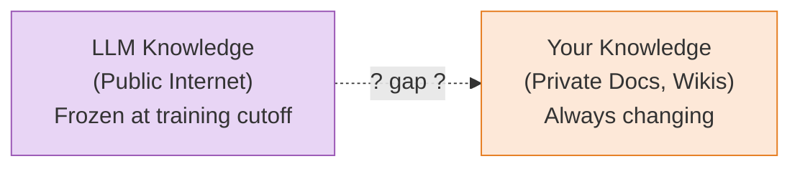
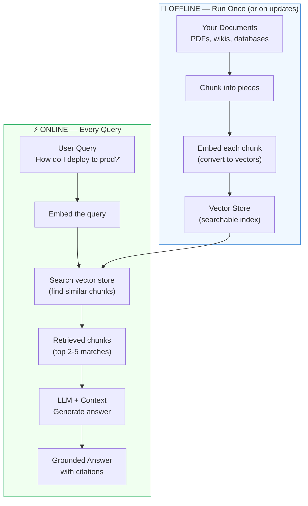
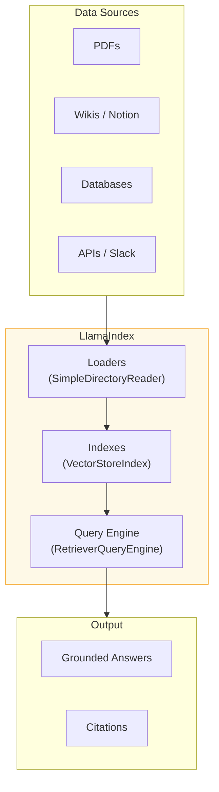
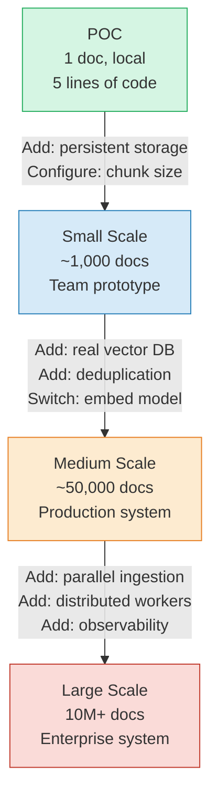

# Chapter 1: The Problem with LLMs and Private Data

> **Series:** Building a Production RAG System with LlamaIndex  
> **Usecase:** Your engineering team has a 50,000-page internal wiki. You want engineers to ask questions and get answers — without copy-pasting docs into ChatGPT.

---

## The moment every developer hits

You have built a chatbot. It is brilliant. It explains code, answers architecture questions, drafts emails.

Then your manager asks: *"Can it answer questions about our internal deployment process?"*

You paste a few docs into the prompt. It works. You paste ten docs. Still works. You try to give it your entire wiki.

It crashes. Context limit exceeded.

You have just hit the core limitation of every Large Language Model in production: **LLMs know a lot about the public internet, but they know nothing about your company.**

---

## Why this happens — the knowledge gap

Every LLM is trained on a snapshot of public data — Wikipedia, GitHub, Stack Overflow, books, arXiv papers. That training ends at a cutoff date. After that, the model is frozen. It cannot learn new facts unless you retrain it.

Your company's data is private, constantly changing, and was never in the training set. When you ask an LLM about your internal API design, it has two choices: say "I don't know", or make something up. Most models choose the second option. This is called **hallucination**.



This gap is the problem. You need a way to give the LLM access to your private data **at query time**, without retraining it.

---

## The three solutions most engineers try first

Before reaching for LlamaIndex, every engineer tries at least one of these. Each one teaches you something important.

### Solution 1: Stuff everything into the prompt

The simplest idea — just put all your docs into the system prompt.

```python
# The naive approach
with open("company_wiki.txt") as f:
    wiki_content = f.read()

prompt = f"""
You are a helpful assistant. Here is our company wiki:

{wiki_content}

Answer questions based on this.
"""
```

**Why it fails:**

Modern LLMs support 128k token context windows. That sounds large — until you do the math. One page of text ≈ 500 tokens. Your 50,000-page wiki = 25 million tokens. That is 200x the context window limit. Even if you could fit it, every single query would process all 25 million tokens. At $0.01 per 1,000 tokens, one question costs $250. For 500 engineers asking 10 questions a day, that is $1.25 million per day.

Context windows are finite. Costs are real. This does not scale past a few documents.

### Solution 2: Fine-tune the model on your data

If the model does not know your data, why not train it on your data?

**Why it fails:**

Fine-tuning teaches the model *style and behavior* — how to format responses, what tone to use, which tasks to prioritize. It does not reliably teach *facts*. A model fine-tuned on your wiki will still hallucinate specific details. It has learned the pattern of your docs, not the content.

More practically: fine-tuning costs thousands of dollars per run. Your wiki changes every day. You cannot re-fine-tune for every page edit. And even if you did, there is no way to cite which document an answer came from.

### Solution 3: Build a search engine over your docs

Return the most relevant documents for any query, then show them to the user.

**Why it fails (partially):**

This actually works for information retrieval. But it is not a conversational interface. You get a list of documents back, not an answer. The user still has to read through them and synthesize the answer themselves. You lose the reasoning and synthesis capability that makes LLMs valuable in the first place.

---

## The right answer: RAG

Retrieval-Augmented Generation (RAG) combines the best of both: **search precision + LLM reasoning**.

The idea is straightforward:
1. Pre-process your documents into a searchable format (offline, done once)
2. When a query comes in, search for the most relevant chunks (fast, cheap)
3. Give only those relevant chunks to the LLM as context (fits in the context window)
4. The LLM reasons over the relevant chunks and produces a grounded answer



Instead of giving the LLM 25 million tokens, you give it 2,000 tokens of the most relevant content. The answer is grounded in your actual documents. You can cite the source. Cost is predictable.

This is what LlamaIndex implements.

---

## What LlamaIndex actually is

LlamaIndex is the framework that orchestrates the entire RAG pipeline. It handles three jobs:

**Job 1 — Data Ingestion:** It knows how to read 130+ data formats (PDF, Word, Notion, Slack, SQL, Google Drive, websites) and convert them into a standard internal format. You do not write PDF parsers. You use a loader.

**Job 2 — Index Construction:** It takes your documents and builds queryable structures — a `VectorStoreIndex` for semantic search, a `SummaryIndex` for summarization, a `KeywordTableIndex` for exact-match retrieval.

**Job 3 — Query Orchestration:** It connects the index to the LLM, manages prompt templates, handles retrieval strategies, supports multi-step reasoning with agents, and gives you control over every stage.



What it is NOT: a vector database (it uses them), an LLM (it calls them), a model training framework (it does not touch weights).

---

## The 5-line POC

Before anything complex, this is the simplest possible working system. Run this on your local machine with one document.

### Setup

```bash
pip install llama-index
export OPENAI_API_KEY="your-key-here"
```

Create a test file:

```bash
mkdir my_docs
echo "Our refund policy allows returns within 30 days of purchase. 
Items must be unused and in original packaging. 
Refunds are processed within 5-7 business days back to the original payment method.
For damaged items, contact support@company.com within 48 hours." > my_docs/policy.txt
```

### The POC

```python
from llama_index.core import VectorStoreIndex, SimpleDirectoryReader

# Step 1: Load your document
documents = SimpleDirectoryReader("./my_docs").load_data()

# Step 2: Build a searchable index (chunks + embeds everything)
index = VectorStoreIndex.from_documents(documents)

# Step 3: Create a query engine
engine = index.as_query_engine()

# Step 4: Ask a question
response = engine.query("What is the refund policy?")
print(response)
# → "Refunds are allowed within 30 days. Items must be unused and 
#    in original packaging. Processing takes 5-7 business days."
```

Four lines of code. That is the entire RAG pipeline.

What each line actually does under the hood:

```python
# SimpleDirectoryReader reads every file in the folder
# Each file becomes a Document object with text + metadata
documents = SimpleDirectoryReader("./my_docs").load_data()
print(f"Loaded {len(documents)} document(s)")
print(f"First doc ID: {documents[0].doc_id}")
print(f"Metadata: {documents[0].metadata}")
# → {'file_name': 'policy.txt', 'file_size': 312, 'creation_date': '2024-06-10'}

# from_documents runs the full ingestion pipeline:
# 1. Splits documents into chunks (SentenceSplitter)
# 2. Embeds each chunk (OpenAI text-embedding-ada-002 by default)
# 3. Stores vectors in an in-memory dict (SimpleVectorStore)
index = VectorStoreIndex.from_documents(documents)

# as_query_engine wires together:
# - VectorIndexRetriever (finds top-2 chunks by cosine similarity)
# - ResponseSynthesizer (builds prompt + calls LLM)
engine = index.as_query_engine()

# query embeds your question, searches for similar chunks,
# builds a prompt, calls the LLM, returns a Response object
response = engine.query("What is the refund policy?")
print(response.response)           # the answer string
print(response.source_nodes)       # which chunks produced the answer
```

---

## The repo structure — your map to the codebase

When you want to understand how something works, knowing where to look saves hours.

```
llama_index/
├── llama-index-core/                  ← The brain. Start here.
│   └── llama_index/core/
│       ├── schema.py                  ← Document, TextNode, BaseNode (Ch. 2)
│       ├── ingestion/pipeline.py      ← IngestionPipeline (Ch. 5)
│       ├── node_parser/               ← SentenceSplitter, chunking (Ch. 3)
│       ├── embeddings/                ← BaseEmbedding, resolution (Ch. 4)
│       ├── indices/vector_store/      ← VectorStoreIndex (Ch. 6)
│       ├── query_engine/              ← RetrieverQueryEngine (Ch. 7)
│       ├── retrievers/                ← VectorIndexRetriever (Ch. 8)
│       ├── response_synthesizers/     ← How answers get built (Ch. 7)
│       ├── agent/                     ← AgentRunner, ReAct loop (Ch. 11)
│       └── callbacks/                 ← Observability hooks (Ch. 10)
│
├── llama-index-integrations/          ← 300+ swappable backends
│   ├── llms/openai/                   ← OpenAI LLM
│   ├── llms/ollama/                   ← Local Ollama models
│   ├── vector_stores/chroma/          ← ChromaDB
│   ├── vector_stores/pinecone/        ← Pinecone
│   └── embeddings/huggingface/        ← HuggingFace embed models
```

The key architectural insight: `llama-index-core` defines **abstract interfaces** (`BaseLLM`, `BaseEmbedding`, `BaseVectorStore`). The integrations implement those interfaces for specific providers. This is why the same query engine code works whether your vector store is an in-memory Python dict or a distributed Pinecone cluster.

---

## From POC to production — what changes

The 5-line POC works for one document on your laptop. Here is what breaks and what you need at each scale:



| Concern | POC (1 doc) | Small (1k docs) | Production (50k) | Enterprise (10M) |
|---|---|---|---|---|
| Storage | RAM (lost on restart) | Local file persist | PostgreSQL / Redis | Distributed vector DB |
| Embedding | OpenAI (10/batch) | OpenAI (10/batch) | OpenAI or local | Local GPU, batched |
| Deduplication | None | None | DocstoreStrategy | DocstoreStrategy + cache |
| Parallelism | Single process | Single process | num_workers=4 | Worker pool + queue |
| Retrieval | top-k cosine | top-k cosine | Hybrid (BM25 + vector) | ANN index |
| Observability | None | Logging | CallbackManager | Full tracing + metrics |

Each chapter in this series adds one layer. By the end, you will have built the full production system.

---

## What's next

In Chapter 2, we go inside the `Document` object — exactly what fields it holds, how metadata is attached automatically, and how the class hierarchy (`BaseComponent → BaseNode → TextNode → Document`) is designed so that a PDF page, a Slack message, and a database row all end up with the same shape. This is the foundation that makes the rest of the pipeline data-source-agnostic.
