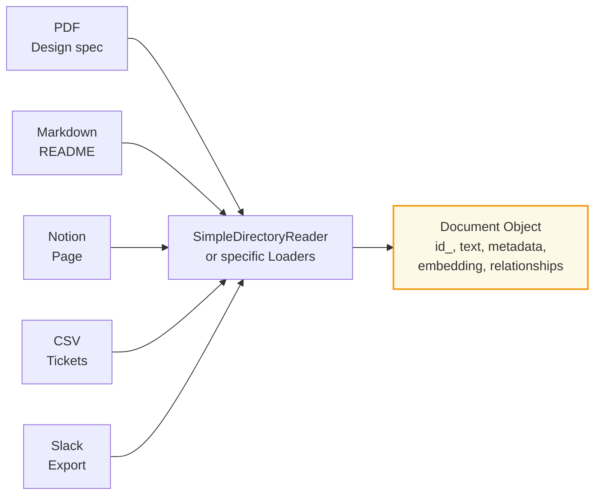
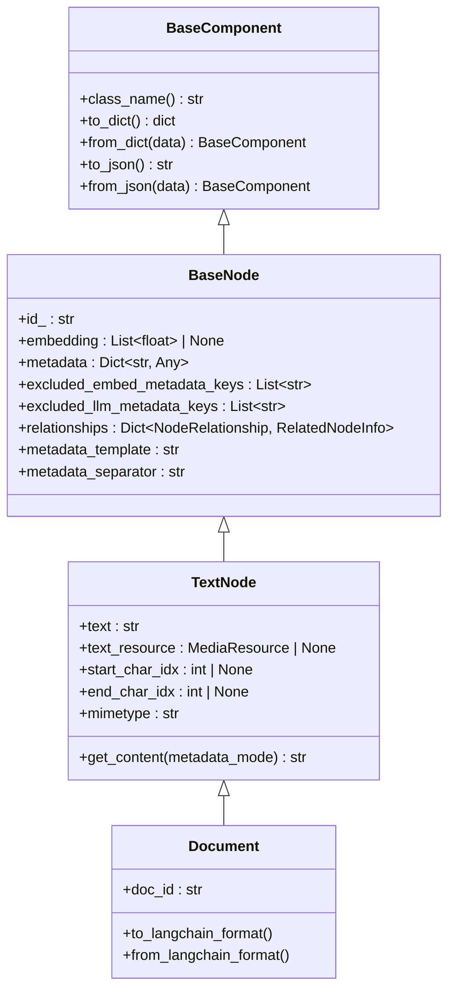
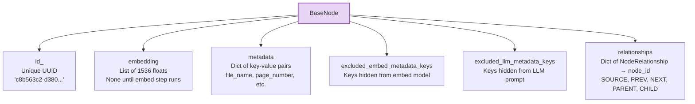
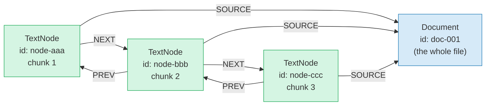

# Chapter 2: How LlamaIndex Reads Your Documents

> **Series:** Building a Production RAG System with LlamaIndex  
> **Usecase:** Your 50,000-page company wiki spans PDFs, Confluence pages, Notion docs, and plain text files. Before you can search any of it, LlamaIndex needs to read it and put it into a standard shape.

---

## The problem this chapter solves

Imagine you have five different document types: a PDF design spec, a Markdown README, a Notion page, a Slack thread export, and a CSV of support tickets. Each one is a completely different format.

Your search and retrieval system does not care about format. It cares about **text and metadata**. Before any chunking, embedding, or indexing can happen, every document — regardless of source — needs to be converted into the same internal structure.

This is what the document layer does. It is the intake desk of the entire pipeline.



Every format goes in. One consistent shape comes out. That shape is the `Document` object.

---

## Why a standard shape matters

If every component downstream — the chunker, the embedder, the retriever — had to handle PDFs differently from Markdown, the codebase would be a mess of `if format == 'pdf'` branches. Instead, LlamaIndex uses a class hierarchy where every piece of text, regardless of where it came from, becomes a `TextNode`. The chunker does not know it is working on a PDF. The embedder does not know it is working on a Notion page. They only see nodes.

This is the same principle as USB-C: one port, every device. The `TextNode` is the USB-C port of LlamaIndex.

---

## The class hierarchy

There are four classes that build on each other. Each layer adds specific fields without removing anything from the parent.



Let us walk through each layer and understand *why* each field exists.

---

## Layer 1: `BaseComponent` — the serialization contract

Every single object in LlamaIndex inherits from `BaseComponent`. It is built on Pydantic and adds one critical capability: the ability to save and reload any object reliably.

```python
# BaseComponent gives everything these powers:
pipeline.persist("./storage")       # save to disk
pipeline = IngestionPipeline.from_persist_dir("./storage")  # reload

index.storage_context.persist("./index_storage")  # save index
index = load_index_from_storage(storage_context)  # reload index
```

Why Pydantic? Because Pydantic validates field types at assignment time. If you accidentally put a string where a list of floats is expected for an embedding, you get an immediate error at the assignment line — not a mysterious crash three steps later in the similarity search.

---

## Layer 2: `BaseNode` — identity, memory, and graph edges

This is the most important layer. Everything that gets stored, searched, or retrieved is a `BaseNode`.



### `id_` — the primary key

Every node gets a UUID automatically. This is how the `DocStore`, `VectorStore`, and `IndexStore` reference each other without duplication. When the retriever finds a relevant embedding in the `VectorStore`, it looks up the full node content in the `DocStore` using this `id_`.

### `embedding` — populated lazily

The embedding field starts as `None`. It only gets populated when the embed model transformation runs during ingestion. This lazy design is intentional — you can create and manipulate nodes without triggering expensive API calls. The embedding only materialises when you explicitly run the embed step.

### `metadata` — the sticky note

This is a flat dictionary of key-value pairs. LlamaIndex auto-populates several keys when loading files:

```python
# Auto-populated by SimpleDirectoryReader
metadata = {
    "file_path":          "/docs/policy.txt",
    "file_name":          "policy.txt",
    "file_size":          4821,
    "creation_date":      "2024-06-10",
    "last_modified_date": "2024-06-12"
}
```

You can add your own keys:

```python
from llama_index.core import SimpleDirectoryReader

def add_department_metadata(filename):
    return {"department": "engineering", "confidential": False}

reader = SimpleDirectoryReader(
    "./docs",
    file_metadata=add_department_metadata
)
documents = reader.load_data()
# Now every document has department + confidential in metadata
```

### `excluded_embed_metadata_keys` and `excluded_llm_metadata_keys` — two audiences, one dict

This is a clever design that solves a real problem.

Your metadata serves two different consumers: the **embed model** (which creates the vector) and the **LLM** (which reads it in the prompt). These two audiences have different needs.

The embed model should not know about `file_path` — it would pollute the semantic vector with filesystem noise. "Policy.txt" being in `/home/john/docs/` vs `/var/app/docs/` should not change what the text *means*.

The LLM should know about `file_name` and `creation_date` so it can include citations like *"According to policy.txt (updated June 2024)..."*

```python
node.excluded_embed_metadata_keys = ["file_path", "file_size", "creation_date"]
# → These keys are stripped before computing the embedding

node.excluded_llm_metadata_keys = ["file_size"]
# → file_size is stripped from the LLM prompt (irrelevant to the answer)
# → file_path, file_name, creation_date remain visible to the LLM
```

When `get_content(MetadataMode.EMBED)` is called, the result looks like:

```
file_name: policy.txt

Our refund policy allows returns within 30 days...
```

When `get_content(MetadataMode.LLM)` is called, the result looks like:

```
file_name: policy.txt
creation_date: 2024-06-10

Our refund policy allows returns within 30 days...
```

Same node. Two different views of its content. One dict, two exclude lists.

### `relationships` — the graph

This is what turns a flat list of chunks into a navigable graph. The `relationships` dict maps a `NodeRelationship` enum value to a `RelatedNodeInfo` object (which holds the related node's `id_`).



There are five relationship types:

| Relationship | Direction | Used for |
|---|---|---|
| `SOURCE` | chunk → original document | Citation: "this came from policy.txt" |
| `PREVIOUS` | chunk → preceding chunk | Context: what came before this chunk |
| `NEXT` | chunk → following chunk | Context: what comes after this chunk |
| `PARENT` | small chunk → larger chunk | Hierarchical chunking (Ch. 3) |
| `CHILD` | large chunk → smaller chunk | Hierarchical chunking (Ch. 3) |

When you call `response.source_nodes` on a query response, you are walking the `SOURCE` relationship from each retrieved chunk back to its original document. That is how citations work.

---

## Layer 3: `TextNode` — the actual content

`TextNode` extends `BaseNode` and adds the text itself. This is what gets chunked, embedded, and retrieved.

```python
# What a TextNode looks like after chunking
node = TextNode(
    id_           = "node-aaa-111",
    text          = "Our refund policy allows returns within 30 days...",
    start_char_idx = 0,      # where this chunk starts in the original doc
    end_char_idx   = 312,    # where it ends
    mimetype      = "text/plain",
    metadata      = {"file_name": "policy.txt", ...},
    relationships = {
        NodeRelationship.SOURCE: RelatedNodeInfo(node_id="doc-001"),
        NodeRelationship.NEXT:   RelatedNodeInfo(node_id="node-bbb-222"),
    }
)
```

`start_char_idx` and `end_char_idx` are more important than they look. They let you map retrieved chunks back to exact positions in the source document. This is how you build precise citation systems that say *"Answer found at paragraph 3 of page 7"* instead of just *"Answer found in policy.txt"*.

The `get_content(metadata_mode)` method is what every downstream component calls to get the text it should work with:

```python
# What the EMBED model sees
node.get_content(MetadataMode.EMBED)
# → "file_name: policy.txt\n\nOur refund policy allows returns..."

# What the LLM sees  
node.get_content(MetadataMode.LLM)
# → "file_name: policy.txt\ncreation_date: 2024-06-10\n\nOur refund policy..."

# Raw text only
node.get_content(MetadataMode.NONE)
# → "Our refund policy allows returns within 30 days..."
```

---

## Layer 4: `Document` — the pre-chunking wrapper

`Document` extends `TextNode` with almost no new fields. That is intentional.

A `Document` represents a whole file before chunking. A `TextNode` represents a chunk after chunking. They have the same structure because after chunking, the system treats them identically — both are nodes in the graph, both live in stores, both have the same fields.

The main additions in `Document`:

```python
doc.doc_id      # convenience alias for id_ — same UUID, friendlier name
doc.text        # the full raw document text (before it gets split)
```

And interoperability methods for other frameworks:

```python
# Convert to LangChain format
lc_doc = doc.to_langchain_format()

# Convert from LangChain format  
doc = Document.from_langchain_format(lc_doc)
```

---

## The POC: inspect what loading actually produces

Let us look at what you get when you load a real document. This is important to run before building anything else — understanding the shape of your data is step one.

### Single document inspection

```python
from llama_index.core import SimpleDirectoryReader

# Load a single file
documents = SimpleDirectoryReader(input_files=["./policy.txt"]).load_data()
doc = documents[0]

# Inspect the Document object
print("=== Document Fields ===")
print(f"doc_id:     {doc.doc_id}")
print(f"text[:100]: {doc.text[:100]}")
print(f"metadata:   {doc.metadata}")
print(f"embedding:  {doc.embedding}")  # None — not yet embedded

# Output:
# doc_id:     c8b563c2-d380-4b9a-867c-d7f3d38808cb
# text[:100]: Our refund policy allows returns within 30 days of purchase.
#             Items must be unused and in original packaging.
# metadata:   {'file_path': './policy.txt', 'file_name': 'policy.txt',
#              'file_size': 312, 'creation_date': '2024-06-10',
#              'last_modified_date': '2024-06-12'}
# embedding:  None
```

### Adding custom metadata

```python
# You often want to add domain-specific metadata
from llama_index.core import SimpleDirectoryReader

def custom_metadata(filename: str) -> dict:
    # You can pull from a database, filename pattern, config file, etc.
    metadata = {}
    if "hr" in filename:
        metadata["department"] = "HR"
        metadata["confidential"] = True
    elif "engineering" in filename:
        metadata["department"] = "Engineering"
        metadata["confidential"] = False
    return metadata

documents = SimpleDirectoryReader(
    "./docs",
    file_metadata=custom_metadata
).load_data()

# Now every document has department + confidential fields
for doc in documents:
    print(doc.metadata)
# → {'file_name': 'hr_policy.txt', 'department': 'HR', 'confidential': True, ...}
```

### Controlling what the embed model and LLM see

```python
from llama_index.core import SimpleDirectoryReader, VectorStoreIndex

documents = SimpleDirectoryReader("./docs").load_data()

for doc in documents:
    # Do not let file_path or file_size pollute the semantic embedding
    doc.excluded_embed_metadata_keys = ["file_path", "file_size", "creation_date"]
    
    # Do not clutter the LLM prompt with file_size
    doc.excluded_llm_metadata_keys = ["file_size", "file_path"]

# Now build the index — these settings propagate to every chunk created from these docs
index = VectorStoreIndex.from_documents(documents)
```

### Loading multiple formats

```python
from llama_index.core import SimpleDirectoryReader

# SimpleDirectoryReader auto-detects format by file extension
# Supports: .txt, .pdf, .docx, .csv, .md, .html, .json, .ipynb, and more
documents = SimpleDirectoryReader(
    "./docs",
    recursive=True,         # include subdirectories
    required_exts=[".pdf", ".txt", ".md"],  # only these formats
    exclude=["temp/", "*.draft.md"],        # skip these
).load_data()

print(f"Loaded {len(documents)} documents")
for doc in documents:
    print(f"  {doc.metadata['file_name']} — {len(doc.text)} chars")
```

---

## Scaling up: loading millions of documents

The POC loads everything synchronously into memory. At 50,000 documents, that has three problems:

1. **Memory** — all text in RAM simultaneously
2. **Speed** — sequential file reads, one at a time
3. **Reliability** — one failed file crashes the whole load

Here is how loading changes at scale:

### Problem 1: Loading from cloud storage instead of local disk

At production scale, documents live in S3, GCS, or Azure Blob — not a local folder.

```python
# S3 reader — same Document output, different source
from llama_index.readers.s3 import S3Reader

reader = S3Reader(
    bucket="company-wiki-bucket",
    prefix="engineering/",
    aws_access_id="...",
    aws_access_secret="...",
)
documents = reader.load_data()
```

Same `Document` shape. The rest of the pipeline does not change.

### Problem 2: Async loading for speed

```python
from llama_index.core import SimpleDirectoryReader

reader = SimpleDirectoryReader("./docs")

# Async load — does not block while waiting for file I/O
documents = await reader.aload_data()
```

### Problem 3: Process documents in batches, not all at once

```python
from llama_index.core import SimpleDirectoryReader, VectorStoreIndex

reader = SimpleDirectoryReader("./docs")
all_files = reader.input_files   # list of Path objects

BATCH_SIZE = 100

for i in range(0, len(all_files), BATCH_SIZE):
    batch_files = all_files[i : i + BATCH_SIZE]
    
    batch_reader = SimpleDirectoryReader(input_files=batch_files)
    batch_docs = batch_reader.load_data()
    
    # Insert this batch into the index
    # The index persists between batches (covered in Ch. 5)
    for doc in batch_docs:
        index.insert(doc)
    
    print(f"Processed batch {i // BATCH_SIZE + 1}, total docs: {i + len(batch_files)}")
```

### The full picture: Day One vs Production

```mermaid
graph TD
    subgraph DAY_ONE ["Day One — Local, 1 Document"]
        LF["Local File\n./docs/policy.txt"]
        SDR["SimpleDirectoryReader\nSynchronous"]
        RAM["Documents in RAM\nDocument objects"]
        LF --> SDR --> RAM
    end

    subgraph PRODUCTION ["Production — Cloud, 50,000 Documents"]
        S3["S3 / GCS / Azure\n50,000 documents"]
        AR["Cloud Reader\n+ Async load"]
        BATCH["Batch processor\n100 docs at a time"]
        META["Custom metadata\nDepartment, access level"]
        PERSIST["Persistent DocStore\nRedis / PostgreSQL"]
        S3 --> AR --> BATCH --> META --> PERSIST
    end

    style DAY_ONE fill:#d5f5e3,stroke:#27ae60
    style PRODUCTION fill:#fdebd0,stroke:#e67e22
```



| Concern | Day One | Production |
|---|---|---|
| Source | Local folder | S3 / GCS / Confluence / Notion APIs |
| Loading | Synchronous | Async + parallel |
| Volume | All at once | Batched, 100 docs per batch |
| Metadata | Auto (filename, dates) | Custom enrichment (dept, access level) |
| Storage | RAM | Persistent DocStore (Redis/Postgres) |
| Error handling | Crash on bad file | Skip + log bad files, continue batch |
| Deduplication | None | Hash-based (covered in Ch. 5) |

---

## One thing to remember

Every document in LlamaIndex — whether it is a PDF page, a Slack message, a SQL row, or a YouTube transcript — ends up as a `TextNode` with the same fields: `id_`, `text`, `metadata`, `embedding`, `relationships`. That uniformity is what makes the entire downstream pipeline (chunking, embedding, retrieval) completely data-source-agnostic.

The document layer is not the exciting part of RAG. But it is the foundation. Get this right — especially the metadata and the exclusion keys — and every downstream step benefits.

---

## What's next

In Chapter 3, we take these `Document` objects and cut them into searchable chunks. We will cover why you cannot embed a 100-page document as one unit, how the `SentenceSplitter` works internally (including the `chunk_overlap` trick), and how chunking builds the `PREV` / `NEXT` / `SOURCE` relationship graph we introduced in this chapter.
