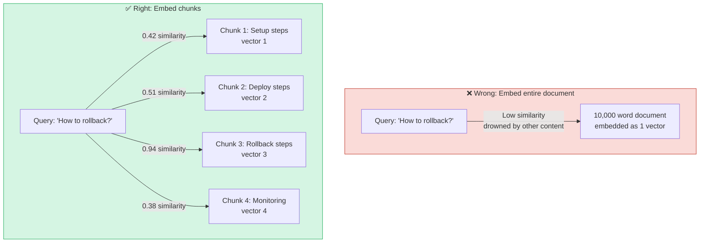
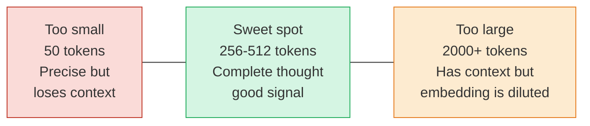
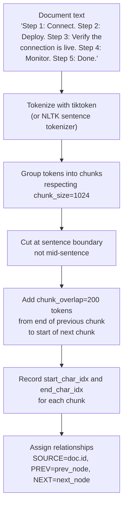
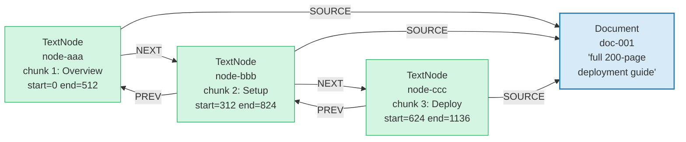
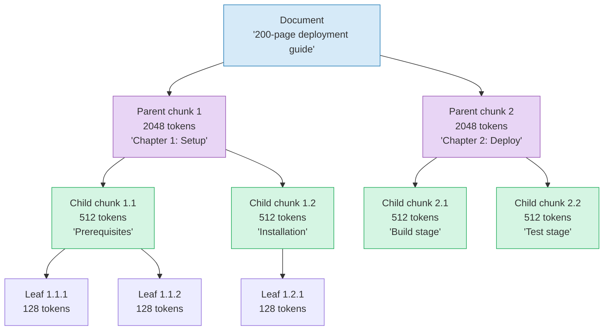
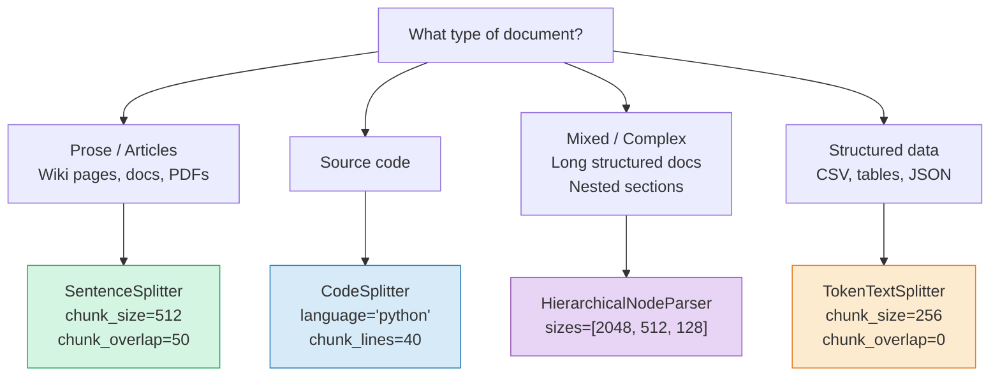
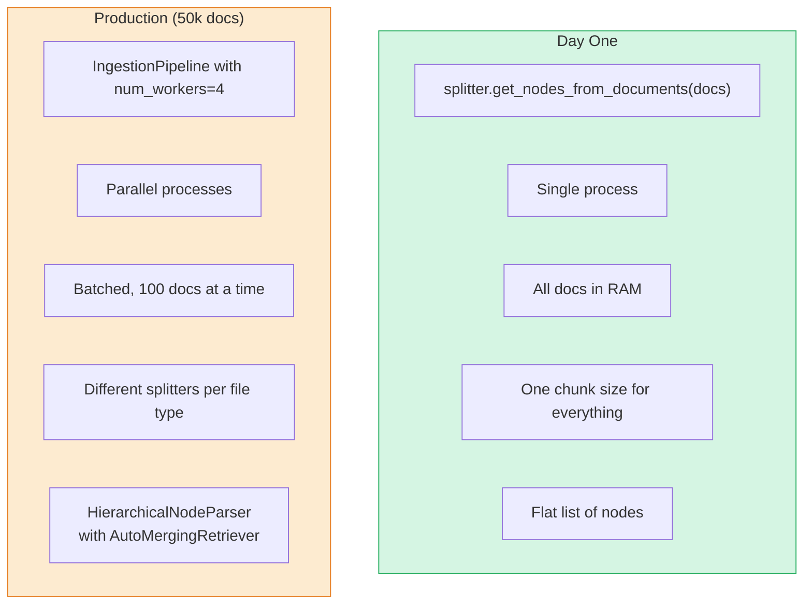

# Chapter 3: Chunking — Turning Documents into Searchable Pieces

> **Series:** Building a Production RAG System with LlamaIndex  
> **Usecase:** Your company wiki has a 200-page deployment guide. You cannot embed it as one unit. You need to cut it into pieces that are small enough to embed meaningfully but large enough to contain a complete thought.

---

## The problem this chapter solves

You have a `Document` object containing 10,000 words. You want to search it by meaning.

Here is the problem with embedding the whole thing as one vector: embedding models compress text into a fixed-size vector — typically 1536 numbers. When you compress 10,000 words into 1536 numbers, the signal from any one specific sentence gets drowned out by all the other sentences. Ask "how do I roll back a deployment?" and the embedding of that question will not closely match the embedding of your 10,000-word document — even if the answer is in there.

Think of it this way: a book's ISBN number does not help you find a specific paragraph. You need a finer unit of search.



Chunking is the step that converts one big document into many small, independently-searchable pieces — each one precise enough to embed meaningfully.

---

## The core tension: chunk size vs chunk quality

Every chunking decision is a tradeoff between two competing pressures.

**Too small:** Each chunk is precise but loses context. A sentence like *"See the previous section for prerequisites"* means nothing in isolation.

**Too large:** Each chunk has context but is imprecise. The embedding gets diluted by irrelevant sentences.

The sweet spot is a chunk that contains one complete thought — enough context that it can be understood independently, small enough that its embedding is specific to that thought.



Default in LlamaIndex: `chunk_size=1024` tokens, `chunk_overlap=200` tokens. This is a safe general-purpose starting point. You will tune it based on your specific documents in production.

---

## How `SentenceSplitter` works internally

`SentenceSplitter` is the default chunker. It does not blindly cut at token N — it tries to cut at sentence boundaries, keeping chunks coherent.

Here is the internal algorithm, step by step:



The `chunk_overlap` is the key innovation. Without it, a thought that straddles two chunk boundaries gets split in half and neither chunk can answer questions about it. With overlap, both chunks carry the bridging context.

```
Document text:
"...The deployment pipeline runs in three stages.
 First, the build stage compiles the code.         ← End of chunk 1
 Second, the test stage runs all unit tests.       ← Also in chunk 2 (overlap)
 Third, the deploy stage pushes to production..."  ← Chunk 2 continues

chunk_1: "...The deployment pipeline runs in three stages. First, the build stage compiles the code."
chunk_2: "First, the build stage compiles the code. Second, the test stage runs all unit tests. Third..."
                ↑
         200 tokens of overlap
         from chunk_1 copied here
```

A query about "what stages does the deployment pipeline have?" matches chunk 1. A query about "what does the test stage do?" matches chunk 2. Because of the overlap, both answers have the pipeline context they need.

---

## The graph that gets built

When `SentenceSplitter` processes a document, it does not just produce a flat list of strings. It produces a linked structure of `TextNode` objects with relationships set.



The `start_char_idx` overlap between chunks (312 < 512, 624 < 824) is deliberate — that is the 200-token overlap zone.

---

## The different chunking strategies

LlamaIndex ships several chunkers. Each one optimises for a different document type.

### `SentenceSplitter` — general purpose

Cuts at sentence boundaries. Best for prose documents: wiki pages, documentation, support articles.

```python
from llama_index.core.node_parser import SentenceSplitter

splitter = SentenceSplitter(
    chunk_size=512,      # max tokens per chunk
    chunk_overlap=50,    # token overlap between chunks
)
```

### `TokenTextSplitter` — raw token cutting

Cuts purely by token count, ignoring sentence boundaries. Faster, but can split mid-sentence. Best for code, tables, or structured data where sentence boundaries are not meaningful.

```python
from llama_index.core.node_parser import TokenTextSplitter

splitter = TokenTextSplitter(
    chunk_size=512,
    chunk_overlap=50,
)
```

### `CodeSplitter` — structure-aware for code

Uses the tree-sitter AST parser to split code at function and class boundaries, not at line N. A function is kept together as one chunk even if it is 200 lines. This is the right chunker for your codebase documentation.

```python
from llama_index.core.node_parser import CodeSplitter

splitter = CodeSplitter(
    language="python",   # uses tree-sitter grammar for this language
    chunk_lines=40,      # target lines per chunk
    chunk_lines_overlap=5,
)
```

### `HierarchicalNodeParser` — for complex queries

This is the most powerful chunker, and the most nuanced. Instead of one chunk size, it creates three levels of chunks from the same document:

- **Level 1 (large):** 2048 tokens — broad context, good for summarisation
- **Level 2 (medium):** 512 tokens — standard retrieval units
- **Level 3 (small, leaves):** 128 tokens — precise retrieval, high specificity



The retriever searches the leaf nodes (most precise). When it finds relevant leaves, it can walk up to the parent for broader context. This is how `AutoMergingRetriever` works — if 3 out of 4 sibling leaves match a query, return the parent instead. You get precision in retrieval and context in the answer.

---

## Choosing the right strategy



---

## The POC: run chunking and inspect the output

Before you build the full pipeline, spend ten minutes just looking at what your chunker produces. This is the single most valuable debugging step in RAG development.

### Basic chunking and inspection

```python
from llama_index.core import SimpleDirectoryReader
from llama_index.core.node_parser import SentenceSplitter

# Load document
documents = SimpleDirectoryReader(input_files=["./deployment_guide.txt"]).load_data()

# Create splitter
splitter = SentenceSplitter(chunk_size=512, chunk_overlap=50)

# Chunk the documents into nodes
nodes = splitter.get_nodes_from_documents(documents)

print(f"Document count: {len(documents)}")
print(f"Node (chunk) count: {len(nodes)}")
print(f"Average chunk length: {sum(len(n.text) for n in nodes) // len(nodes)} chars")
print()

# Inspect the first three nodes
for i, node in enumerate(nodes[:3]):
    print(f"=== Node {i+1} ===")
    print(f"ID:            {node.id_}")
    print(f"Text preview:  {node.text[:120]}...")
    print(f"start_char:    {node.start_char_idx}")
    print(f"end_char:      {node.end_char_idx}")
    print(f"Relationships: {list(node.relationships.keys())}")
    print()
```

Expected output:

```
Document count: 1
Node (chunk) count: 24
Average chunk length: 487 chars

=== Node 1 ===
ID:            aaa-111-...
Text preview:  The deployment pipeline is the core of our release process.
               It consists of three stages: build, test, and deploy...
start_char:    0
end_char:      512
Relationships: [<NodeRelationship.SOURCE: '1'>, <NodeRelationship.NEXT: '3'>]

=== Node 2 ===
ID:            bbb-222-...
Text preview:  build, test, and deploy. The build stage compiles all source
               code and produces a Docker image...
start_char:    312        ← 200 chars of overlap with node 1
end_char:      824
Relationships: [SOURCE, PREV, NEXT]

=== Node 3 ===
ID:            ccc-333-...
Text preview:  The test stage runs all unit tests, integration tests, and
               security scans before the image is approved...
start_char:    624
end_char:      1136
Relationships: [SOURCE, PREV, NEXT]
```

### Walk the graph — follow PREV and NEXT

```python
from llama_index.core.schema import NodeRelationship

# Build a lookup dict for easy traversal
node_map = {node.id_: node for node in nodes}

# Start at node 5 and walk backwards
current = nodes[5]
print(f"Starting at: {current.text[:80]}...")

# Walk forward through the linked list
while NodeRelationship.NEXT in current.relationships:
    next_id = current.relationships[NodeRelationship.NEXT].node_id
    current = node_map[next_id]
    print(f"  → Next: {current.text[:80]}...")
```

### Check the overlap

```python
# Verify overlap is working correctly
node1 = nodes[0]
node2 = nodes[1]

# The tail of node1's text should appear in the head of node2's text
tail_of_node1 = node1.text[-200:]       # last 200 chars of chunk 1
head_of_node2 = node2.text[:200]        # first 200 chars of chunk 2

# These should share content (the overlap zone)
print("End of chunk 1:")
print(tail_of_node1)
print()
print("Start of chunk 2:")
print(head_of_node2)
```

### Experiment with chunk sizes

Run this to understand how chunk size affects your specific documents before you commit to a value:

```python
from llama_index.core.node_parser import SentenceSplitter

sizes = [128, 256, 512, 1024]

for size in sizes:
    splitter = SentenceSplitter(chunk_size=size, chunk_overlap=size // 5)
    nodes = splitter.get_nodes_from_documents(documents)
    avg_len = sum(len(n.text) for n in nodes) // len(nodes)
    print(f"chunk_size={size:4d} → {len(nodes):3d} chunks, avg {avg_len} chars each")

# Example output:
# chunk_size= 128 →  96 chunks, avg 121 chars each
# chunk_size= 256 →  48 chunks, avg 243 chars each
# chunk_size= 512 →  24 chunks, avg 487 chars each
# chunk_size=1024 →  12 chunks, avg 974 chars each
```

Run this on your actual documents. The right chunk size is the smallest size at which each chunk is still a self-contained thought. Read ten random chunks manually. If they feel incomplete, increase the size. If they feel overly broad, decrease it.

---

## Scaling up: chunking millions of documents

The `get_nodes_from_documents()` call processes everything in memory synchronously. At 50,000 documents this becomes slow and memory-intensive. Here is what changes at scale.

### The bottleneck

For 50,000 documents averaging 5,000 words each:
- Total text: 250 million words ≈ 333 million tokens
- At 512 tokens per chunk: ~650,000 chunks to produce
- Single-threaded: takes ~10 minutes of CPU time
- All in RAM simultaneously: ~4GB for text alone

### Fix 1: Use `IngestionPipeline` instead of calling the splitter directly

The `IngestionPipeline` (covered fully in Chapter 5) handles batching, caching, and parallel processing automatically. Chunking moves from a manual call to a pipeline transformation:

```python
from llama_index.core.ingestion import IngestionPipeline
from llama_index.core.node_parser import SentenceSplitter
from llama_index.embeddings.openai import OpenAIEmbedding

pipeline = IngestionPipeline(
    transformations=[
        SentenceSplitter(chunk_size=512, chunk_overlap=50),
        OpenAIEmbedding(),   # embed each chunk right after splitting
    ]
)

# num_workers distributes work across CPU cores
nodes = pipeline.run(documents=documents, num_workers=4)
```

### Fix 2: Different chunk sizes for different document types

At production scale, your corpus is heterogeneous. You do not want the same chunk size for a 3-line FAQ answer and a 200-page technical specification:

```python
from llama_index.core.node_parser import SentenceSplitter, CodeSplitter
from llama_index.core import SimpleDirectoryReader

# Route different file types to different splitters
def chunk_documents_by_type(documents):
    prose_docs = [d for d in documents if not d.metadata["file_name"].endswith(".py")]
    code_docs  = [d for d in documents if d.metadata["file_name"].endswith(".py")]

    prose_splitter = SentenceSplitter(chunk_size=512, chunk_overlap=50)
    code_splitter  = CodeSplitter(language="python", chunk_lines=40)

    prose_nodes = prose_splitter.get_nodes_from_documents(prose_docs)
    code_nodes  = code_splitter.get_nodes_from_documents(code_docs)

    return prose_nodes + code_nodes

documents = SimpleDirectoryReader("./docs", recursive=True).load_data()
all_nodes = chunk_documents_by_type(documents)
print(f"Total chunks: {len(all_nodes)}")
```

### Fix 3: Hierarchical chunking for the full production setup

For a 50,000-page wiki where some queries are broad ("summarise our deployment philosophy") and some are precise ("what's the rollback command for Kubernetes"), `HierarchicalNodeParser` handles both:

```python
from llama_index.core.node_parser import HierarchicalNodeParser, get_leaf_nodes
from llama_index.core import VectorStoreIndex
from llama_index.core.storage.docstore import SimpleDocumentStore

# Create three levels of chunks
splitter = HierarchicalNodeParser.from_defaults(
    chunk_sizes=[2048, 512, 128]   # parent, child, leaf
)

all_nodes = splitter.get_nodes_from_documents(documents)
leaf_nodes = get_leaf_nodes(all_nodes)   # only the smallest chunks

print(f"Total nodes (all levels): {len(all_nodes)}")
print(f"Leaf nodes (searchable):  {len(leaf_nodes)}")

# Store ALL nodes in docstore (so parents can be fetched during retrieval)
docstore = SimpleDocumentStore()
docstore.add_documents(all_nodes)

# Index only LEAF nodes (precise retrieval)
index = VectorStoreIndex(leaf_nodes, storage_context=storage_context)

# AutoMergingRetriever will walk up to parents when enough sibling leaves match
# (covered in Chapter 8)
```

---

## Day One vs Production comparison



| Concern | Day One | Production |
|---|---|---|
| API | `splitter.get_nodes_from_documents()` | `IngestionPipeline.run()` |
| Parallelism | Single process | `num_workers=4+` |
| Memory | All docs in RAM | Batched processing |
| Chunk strategy | One size for all | Per-format (prose, code, structured) |
| Structure | Flat chunks | Hierarchical (2048/512/128) |
| Re-chunking | Always re-runs | Cached by `IngestionCache` |
| Chunk size | Default 1024 | Tuned to your documents |

---

## The one thing to never skip

Before you build the full pipeline, run the inspection code from the POC section on your actual documents. Read 20 random chunks manually.

Ask yourself: *"If this chunk were the only context given to the LLM, could it answer a question about this topic?"*

If the answer is yes for most chunks, your chunk size is right. If chunks regularly end mid-sentence or start without context, your size is too small. If chunks contain multiple unrelated topics, your size is too large.

The five minutes you spend tuning chunk size here saves days of debugging poor retrieval quality later.

---

## What's next

In Chapter 4, we take these chunks and convert them into vectors — the embeddings that make semantic search possible. We will cover what an embedding actually is geometrically, why the embed model used during ingestion must be identical to the one used at query time, and how to choose between OpenAI, HuggingFace, and local models.
