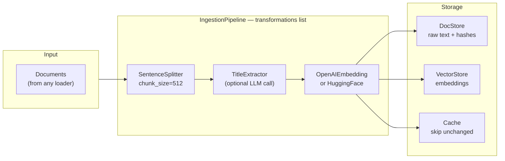
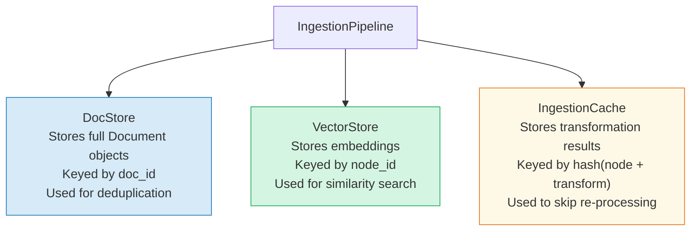
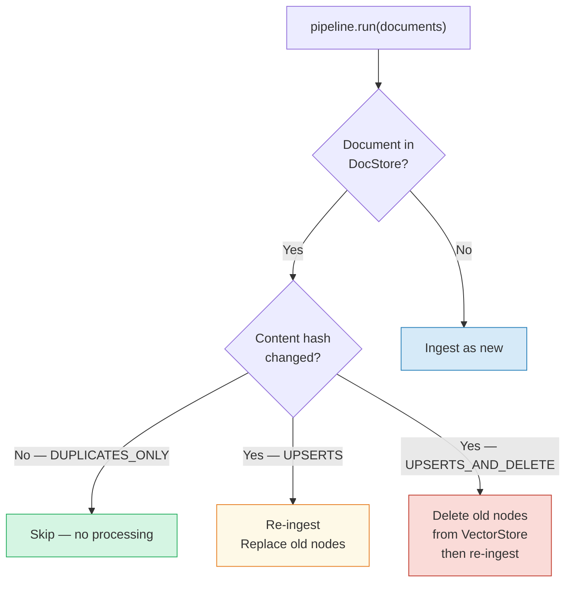
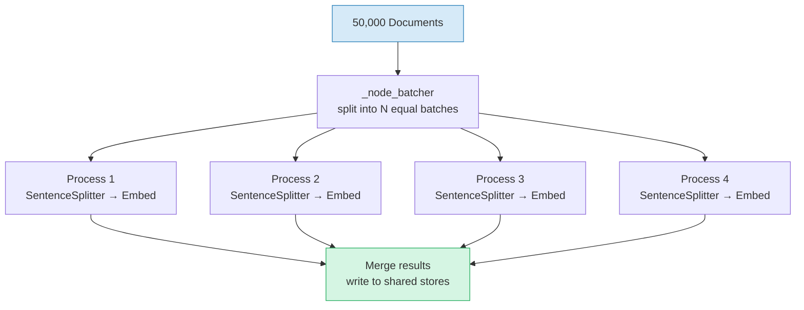

# Chapter 5: The Ingestion Pipeline — The Assembly Line

> **Series:** Building a Production RAG System with LlamaIndex
> **Usecase:** You have 50,000 wiki pages. Each one needs to be loaded, chunked, embedded, and stored. You need this to run daily, skip unchanged documents, and never re-embed what is already cached.

---

## The problem this chapter solves

In the previous chapters, we ran each step manually:

```python
documents = SimpleDirectoryReader("./docs").load_data()     # Ch 2
nodes     = SentenceSplitter().get_nodes_from_documents(documents) # Ch 3
vectors   = embed_model.get_text_embedding_batch(...)       # Ch 4
```

This works for a one-time run. But in production, you need:

- Chunking and embedding to happen **together**, in the right order
- Changed documents to be **re-processed**, unchanged ones to be **skipped**
- Everything to write into **persistent storage** that survives restarts
- The whole thing to run on a **schedule**, safely, without duplicating data

Running three separate scripts in sequence does not give you any of this. You need an orchestrator. That orchestrator is the `IngestionPipeline`.

---

## What the IngestionPipeline actually is

Think of it as a factory assembly line. Raw materials (documents) enter one end. Each station on the line performs one transformation. Finished goods (embedded nodes) come out the other end and go straight into the warehouse (vector store).



Every item in the `transformations` list is a `TransformComponent`. It implements one method: `__call__(nodes) -> nodes`. The pipeline passes the output of each component as the input to the next. This is the **Chain of Responsibility** pattern — each station does one job and hands off.

---

## The TransformComponent contract

Every transformation in LlamaIndex — splitters, extractors, embed models — implements this interface:

```python
class TransformComponent(BaseComponent):
    def __call__(
        self,
        nodes: List[BaseNode],
        **kwargs: Any
    ) -> List[BaseNode]:
        ...

    async def acall(
        self,
        nodes: List[BaseNode],
        **kwargs: Any
    ) -> List[BaseNode]:
        ...
```

That is it. Takes nodes in, returns nodes out. This means you can write your own transformation in ten lines:

```python
from llama_index.core.ingestion import TransformComponent
from llama_index.core.schema import BaseNode
from typing import List

class AddDepartmentTag(TransformComponent):
    department: str

    def __call__(self, nodes: List[BaseNode], **kwargs) -> List[BaseNode]:
        for node in nodes:
            node.metadata["department"] = self.department
        return nodes
```

Drop it anywhere in the transformations list. It slots in without touching any other code.

---

## The three storage components

The `IngestionPipeline` connects to three independent stores. Each one has a different job.



**DocStore** — stores the raw `Document` objects. When you run the pipeline a second time, it checks the docstore: has this document been seen before? Has its content hash changed? If neither, skip it.

**VectorStore** — stores the final embedded `TextNode` objects. This is what the retriever queries at search time.

**IngestionCache** — caches the result of each `(node_content, transformation)` pair. If you split a document into 20 chunks and embedded them last week, running the pipeline again hits the cache for all 20 chunks — zero API calls.

---

## DocstoreStrategy — the deduplication logic

This is the most important configuration decision for production pipelines. It controls what happens when a document already exists in the docstore.



| Strategy | When to use |
|---|---|
| `DUPLICATES_ONLY` | Static corpus — never re-ingest a seen document |
| `UPSERTS` | Append-only — re-ingest if content changed, keep old nodes until replaced |
| `UPSERTS_AND_DELETE` | Live corpus — re-ingest changed docs AND delete stale nodes from vector store |

For a wiki updated daily, always use `UPSERTS_AND_DELETE`. Without delete, your vector store accumulates stale embeddings from old document versions. Retrievals start returning answers from outdated content with no error.

---

## The POC: single document, inspect the output

Before wiring in Redis and Pinecone, run the simplest version and read what comes out.

### Setup

```bash
pip install llama-index llama-index-embeddings-huggingface
```

### Basic pipeline run

```python
from llama_index.core import SimpleDirectoryReader
from llama_index.core.ingestion import IngestionPipeline
from llama_index.core.node_parser import SentenceSplitter
from llama_index.embeddings.huggingface import HuggingFaceEmbedding

# Load
documents = SimpleDirectoryReader(input_files=["./policy.txt"]).load_data()

# Build pipeline
pipeline = IngestionPipeline(
    transformations=[
        SentenceSplitter(chunk_size=256, chunk_overlap=25),
        HuggingFaceEmbedding(model_name="BAAI/bge-small-en-v1.5"),
    ]
)

# Run
nodes = pipeline.run(documents=documents, show_progress=True)

print(f"Nodes produced: {len(nodes)}")
for node in nodes[:2]:
    print(f"\n  id:        {node.node_id[:8]}...")
    print(f"  text:      {node.text[:80]}...")
    print(f"  embedding: {node.embedding[:4]}... (dim={len(node.embedding)})")
    print(f"  metadata:  {node.metadata}")
```

### Add caching — re-run is instant

```python
from llama_index.core.ingestion import IngestionPipeline, IngestionCache

pipeline = IngestionPipeline(
    transformations=[
        SentenceSplitter(chunk_size=256, chunk_overlap=25),
        HuggingFaceEmbedding(model_name="BAAI/bge-small-en-v1.5"),
    ],
    cache=IngestionCache()   # in-memory cache
)

import time

# First run — processes everything
t0 = time.time()
nodes = pipeline.run(documents=documents)
print(f"First run:  {time.time()-t0:.2f}s  ({len(nodes)} nodes)")

# Second run — all cache hits
t0 = time.time()
nodes = pipeline.run(documents=documents)
print(f"Second run: {time.time()-t0:.2f}s  (should be near 0)")
```

### Add deduplication

```python
from llama_index.core.ingestion import IngestionPipeline, DocstoreStrategy
from llama_index.core.storage.docstore import SimpleDocumentStore

pipeline = IngestionPipeline(
    transformations=[
        SentenceSplitter(chunk_size=256, chunk_overlap=25),
        HuggingFaceEmbedding(model_name="BAAI/bge-small-en-v1.5"),
    ],
    docstore=SimpleDocumentStore(),
    docstore_strategy=DocstoreStrategy.UPSERTS_AND_DELETE,
)

# First run — ingests everything
nodes1 = pipeline.run(documents=documents)
print(f"Run 1: {len(nodes1)} nodes")

# Simulate a document update
documents[0].text = documents[0].text + "\nUpdated: new refund window is 60 days."

# Second run — only re-ingests the changed document
nodes2 = pipeline.run(documents=documents)
print(f"Run 2: {len(nodes2)} nodes (only changed doc re-processed)")
```

---

## Connecting to a VectorStoreIndex

After the pipeline runs, you need to query it. The bridge is `VectorStoreIndex.from_vector_store()` — it reads from whatever vector store the pipeline wrote to.

```python
from llama_index.core import VectorStoreIndex, Settings
from llama_index.core.ingestion import IngestionPipeline
from llama_index.core.node_parser import SentenceSplitter
from llama_index.core.storage.docstore import SimpleDocumentStore
from llama_index.embeddings.huggingface import HuggingFaceEmbedding
from llama_index.core.vector_stores import SimpleVectorStore

Settings.embed_model = HuggingFaceEmbedding(model_name="BAAI/bge-small-en-v1.5")

vector_store = SimpleVectorStore()

pipeline = IngestionPipeline(
    transformations=[
        SentenceSplitter(chunk_size=256, chunk_overlap=25),
        Settings.embed_model,
    ],
    vector_store=vector_store,
)

pipeline.run(documents=documents)

# Build index directly from the vector store — no re-embedding
index = VectorStoreIndex.from_vector_store(vector_store)
engine = index.as_query_engine()
response = engine.query("What is the refund policy?")
print(response)
```

---

## Scaling up: 50,000 documents, daily updates

The single-process pipeline breaks at scale for the same reasons we covered in Chapter 4. Here is the full production configuration.

### Parallel processing



```python
# num_workers distributes batches across CPU processes via multiprocessing.Pool
nodes = pipeline.run(documents=documents, num_workers=4)

# arun — async version, better for API-based embed models (overlaps I/O waits)
nodes = await pipeline.arun(documents=documents, num_workers=4)
```

### Full production pipeline

```python
from llama_index.core import Settings
from llama_index.core.ingestion import (
    IngestionPipeline, IngestionCache, DocstoreStrategy
)
from llama_index.core.ingestion.cache import RedisCache
from llama_index.core.node_parser import SentenceSplitter
from llama_index.embeddings.huggingface import HuggingFaceEmbedding
from llama_index.storage.docstore.redis import RedisDocumentStore
from llama_index.vector_stores.chroma import ChromaVectorStore
import chromadb

# One embed model, used everywhere
Settings.embed_model = HuggingFaceEmbedding(
    model_name="BAAI/bge-base-en-v1.5",
    embed_batch_size=64,
)

# Persistent stores
chroma_client     = chromadb.HttpClient(host="localhost", port=8000)
chroma_collection = chroma_client.get_or_create_collection("wiki")
vector_store      = ChromaVectorStore(chroma_collection=chroma_collection)

pipeline = IngestionPipeline(
    transformations=[
        SentenceSplitter(chunk_size=512, chunk_overlap=50),
        Settings.embed_model,
    ],
    docstore=RedisDocumentStore.from_host_and_port(
        "localhost", 6379, namespace="wiki_docs"
    ),
    vector_store=vector_store,
    cache=IngestionCache(
        cache=RedisCache.from_host_and_port("localhost", 6379),
        collection="wiki_embed_cache",
    ),
    docstore_strategy=DocstoreStrategy.UPSERTS_AND_DELETE,
)

# Daily run — only processes new and changed documents
nodes = pipeline.run(documents=fetch_updated_documents(), num_workers=4)
print(f"Processed {len(nodes)} nodes from changed documents")
```

---

## Day One vs Production

| Concern | Day One | Production |
|---|---|---|
| Transformations | Splitter + Embed model | Same + optional extractors |
| Parallelism | `num_workers=None` (single process) | `num_workers=4`, `arun()` |
| Cache | None or in-memory | `IngestionCache` + Redis |
| DocStore | `SimpleDocumentStore` (RAM) | `RedisDocumentStore` |
| VectorStore | `SimpleVectorStore` (RAM) | Chroma / Pinecone / pgvector |
| Deduplication | None | `UPSERTS_AND_DELETE` |
| Scheduling | Manual one-time run | Cron / Airflow / Celery |
| Re-embedding | All docs every run | Only changed chunks |

---

## What's next

In Chapter 6 we go inside the query side — exactly how a user question flows through `VectorIndexRetriever`, gets embedded, runs cosine similarity against all stored vectors, and returns the top-k chunks. We will trace the math line by line.
