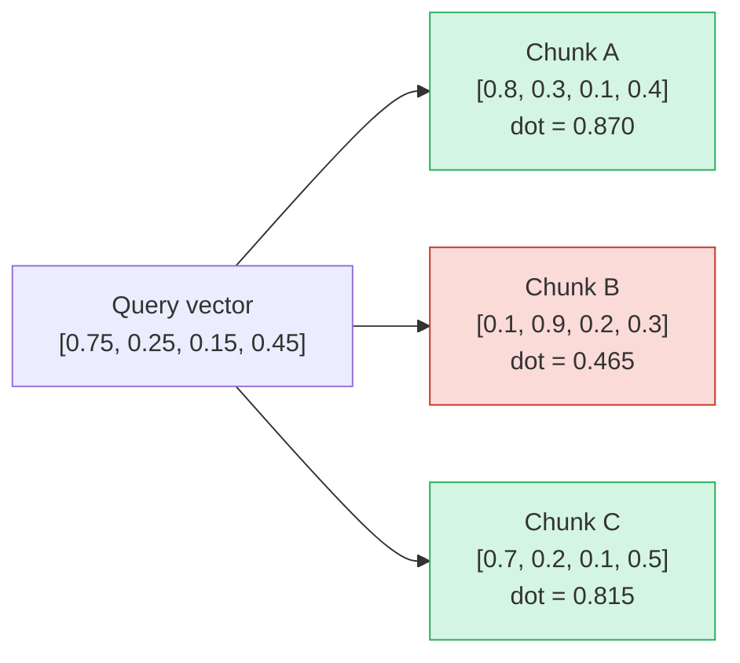
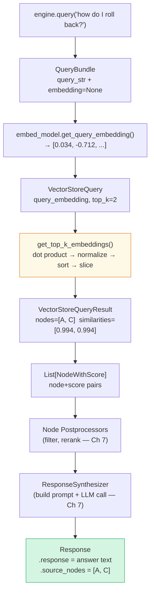
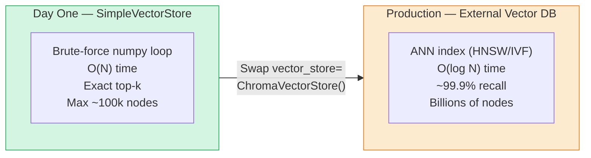

# Chapter 6: How Search Actually Works — Cosine Similarity from Scratch

> **Series:** Building a Production RAG System with LlamaIndex
> **Usecase:** A engineer types "how do I roll back a bad deployment?" Your system has 650,000 chunks. This chapter is the exact math that picks the right 2 from those 650,000 — in under 10ms.

---

## The problem this chapter solves

You have built the pipeline. Documents are chunked and embedded. The vector store is full. Now an engineer asks a question.

What actually happens next? Most tutorials say "similarity search" and move on. That is not enough. If you do not understand the mechanics, you cannot debug retrieval failures, tune `similarity_top_k`, choose between vector stores, or explain to your team why the system sometimes returns wrong answers.

This chapter traces every line of code from `engine.query("...")` to the moment two `TextNode` objects land back in your application.

---

## Step 1: Wrapping the query in a QueryBundle

The first thing `RetrieverQueryEngine` does is wrap your raw string in a `QueryBundle`:

```python
# schema.py
class QueryBundle(BaseComponent):
    query_str:              str          # "how do I roll back a bad deployment?"
    custom_embedding_strs:  List[str]    # optional — embed something different
    embedding:              List[float]  # populated by the retriever
```

Why not just pass the string directly? Because embedding and querying are separate concerns. You might want to embed a rewritten version of the query for better retrieval, while keeping the original string for the LLM prompt. The `QueryBundle` holds both independently.

---

## Step 2: Embedding the query

The retriever calls `embed_model.get_query_embedding(query_bundle.query_str)`. This is the same model used during ingestion — `get_query_embedding` not `get_text_embedding`, because some models use different internal instructions for queries vs documents.

```python
query_bundle.embedding = embed_model.get_query_embedding(
    "how do I roll back a bad deployment?"
)
# → [0.034, -0.712, 0.441, 0.103, -0.234, ..., 0.671]  # 1536 floats
```

This vector represents the **meaning** of the question in the same geometric space as the stored chunk vectors. Searching now becomes: find the stored vectors that point in the same direction as this query vector.

---

## Step 3: Building the VectorStoreQuery

The retriever assembles a query object:

```python
# From VectorIndexRetriever._retrieve()
query = VectorStoreQuery(
    query_embedding   = query_bundle.embedding,   # [0.034, -0.712, ...]
    similarity_top_k  = 2,                        # DEFAULT — return top 2
    query_str         = "how do I roll back...",
    mode              = VectorStoreQueryMode.DEFAULT,  # cosine similarity
    filters           = None,                     # optional metadata pre-filter
)
```

`similarity_top_k=2` is the default and the most common production footgun. Two chunks is almost never enough for complex queries. Most production systems use 5–10.

---

## Step 4: The cosine similarity search

This is the actual math. Here is the exact function from LlamaIndex's source — `get_top_k_embeddings()`:

```python
import numpy as np

def get_top_k_embeddings(
    query_embedding:   List[float],       # shape: (D,)    D = 1536
    doc_embeddings:    List[List[float]], # shape: (N, D)  N = 650,000 chunks
    doc_ids:           List[str],
    similarity_top_k:  int = 2,
) -> Tuple[List[float], List[str]]:

    qembed_np  = np.array(query_embedding)   # (D,)
    dembed_np  = np.array(doc_embeddings)    # (N, D)

    # Dot product: for each chunk, how much does it align with the query?
    dproduct_arr = np.dot(dembed_np, qembed_np)   # (N,)

    # Magnitudes: normalise out the vector lengths
    norm_arr = np.linalg.norm(qembed_np) * np.linalg.norm(dembed_np, axis=1)  # (N,)

    # Cosine similarity = dot product / (magnitude_q * magnitude_d)
    cos_sim_arr = dproduct_arr / norm_arr    # (N,)  values in [-1, +1]

    # Sort descending, take top k
    tups = [(cos_sim_arr[i], doc_ids[i]) for i in range(len(doc_ids))]
    sorted_tups = sorted(tups, key=lambda t: t[0], reverse=True)
    sorted_tups = sorted_tups[:similarity_top_k]

    return [s for s, _ in sorted_tups], [n for _, n in sorted_tups]
```

Let us trace this with real numbers.

---

## Walking through the math

Say you have 3 chunks (simplified to 4 dimensions — same math as 1536):

```
chunk A: "Rollback procedure: run kubectl rollout undo deployment/app"
  → embedding = [0.8, 0.3, 0.1, 0.4]

chunk B: "Kubernetes pods restart automatically on OOMKill events"
  → embedding = [0.1, 0.9, 0.2, 0.3]

chunk C: "To revert a failed deployment, use the rollback command"
  → embedding = [0.7, 0.2, 0.1, 0.5]

query: "how do I roll back a bad deployment?"
  → query_vector = [0.75, 0.25, 0.15, 0.45]
```

**Step 4a — dot products:**



```
chunk A · query = (0.8×0.75) + (0.3×0.25) + (0.1×0.15) + (0.4×0.45) = 0.870
chunk B · query = (0.1×0.75) + (0.9×0.25) + (0.2×0.15) + (0.3×0.45) = 0.465
chunk C · query = (0.7×0.75) + (0.2×0.25) + (0.1×0.15) + (0.5×0.45) = 0.815
```

**Step 4b — magnitudes:**

```
|query|   = √(0.75²+0.25²+0.15²+0.45²) = √0.85 = 0.922
|chunk A| = √(0.8²+0.3²+0.1²+0.4²)     = √0.90 = 0.949
|chunk B| = √(0.1²+0.9²+0.2²+0.3²)     = √0.95 = 0.975
|chunk C| = √(0.7²+0.2²+0.1²+0.5²)     = √0.79 = 0.889
```

**Step 4c — cosine similarity:**

```
cos_sim(A) = 0.870 / (0.922 × 0.949) = 0.994  ✓ HIGH
cos_sim(B) = 0.465 / (0.922 × 0.975) = 0.517  ✗ LOW
cos_sim(C) = 0.815 / (0.922 × 0.889) = 0.994  ✓ HIGH
```

**Step 4d — sort and slice:**

```python
sorted_tups = [(0.994, "chunk_A"), (0.994, "chunk_C"), (0.517, "chunk_B")]
top_2       = [(0.994, "chunk_A"), (0.994, "chunk_C")]   # [:2]
```

Chunks A and C are about rollback procedures. Chunk B is about pod restarts — unrelated. The math correctly separates them.

---

## Step 5: Wrapping results in NodeWithScore

The vector store returns a `VectorStoreQueryResult`. The retriever wraps each node with its score:

```python
# What leaves the retriever
nodes_with_scores = [
    NodeWithScore(node=TextNode("Rollback procedure: run kubectl..."), score=0.994),
    NodeWithScore(node=TextNode("To revert a failed deployment..."),   score=0.994),
]
```

The score travels with the node through the entire downstream pipeline — postprocessors can use it to filter, rerankers can replace it, and `response.source_nodes` exposes it to your application for citation confidence scores.

---

## Step 6: The complete flow



---

## The O(N) problem and ANN

`get_top_k_embeddings()` iterates over **every stored vector**. For N nodes:

| N nodes | Memory (1536-dim, float32) | Query time |
|---|---|---|
| 1,000 | 6 MB | < 1ms |
| 100,000 | 600 MB | ~10ms |
| 1,000,000 | 6 GB | ~100ms |
| 10,000,000 | 60 GB | seconds — unusable |

At scale you swap `SimpleVectorStore` for a vector database that uses **Approximate Nearest Neighbor (ANN)** algorithms. The most common: HNSW (used by Chroma, Weaviate, Qdrant) and IVF (used by Pinecone, Faiss). These trade a tiny recall loss (finding 99.x% of true top-k instead of 100%) for sub-millisecond queries over billions of vectors.



The swap is one line — `vector_store=ChromaVectorStore(...)` in your `IngestionPipeline`. The retriever code does not change. The `VectorStoreQuery` interface is identical.

---

## POC: run the search yourself and inspect scores

```python
import numpy as np
from llama_index.core import VectorStoreIndex, SimpleDirectoryReader, Settings
from llama_index.embeddings.huggingface import HuggingFaceEmbedding

Settings.embed_model = HuggingFaceEmbedding(model_name="BAAI/bge-small-en-v1.5")

documents = SimpleDirectoryReader("./docs").load_data()
index     = VectorStoreIndex.from_documents(documents)

# Use retriever directly — bypass the LLM synthesis step
retriever = index.as_retriever(similarity_top_k=5)
nodes = retriever.retrieve("how do I roll back a bad deployment?")

print(f"Retrieved {len(nodes)} chunks:\n")
for i, node_with_score in enumerate(nodes):
    print(f"  [{i+1}] score={node_with_score.score:.4f}")
    print(f"       file={node_with_score.node.metadata.get('file_name','?')}")
    print(f"       text={node_with_score.node.text[:120]}...")
    print()
```

Run this before ever querying via the full engine. Seeing the raw scores tells you immediately whether retrieval is working — if top scores are below 0.5, your chunks are not matching the query semantically and you need to re-examine your chunk size or embed model.

---

## What's next

In Chapter 7, we follow the retrieved nodes through the rest of the query engine — the postprocessor stage (filtering and reranking) and the response synthesizer (building the LLM prompt and calling the model). The retriever gets the right chunks; the synthesizer turns them into an answer.
