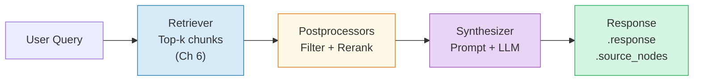
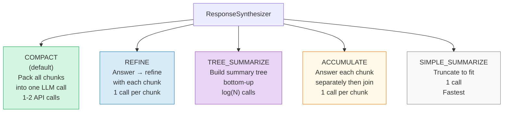

# Chapter 7: The Query Engine — From Question to Answer

> **Series:** Building a Production RAG System with LlamaIndex
> **Usecase:** The retriever has returned 5 chunks about your deployment rollback procedure. Now the system needs to turn those 5 chunks into one coherent answer — with citations, at the right length, grounded in the actual text.

---

## The problem this chapter solves

Chapter 6 ended with `List[NodeWithScore]` — the right chunks, with scores. But a list of text fragments is not an answer. The engineer asked a question. They need a sentence, a paragraph, maybe a step-by-step procedure.

Between the retrieved chunks and the final answer, three more things happen:

1. **Postprocessing** — filter out low-quality chunks, rerank by relevance
2. **Synthesis** — pack the chunks into a prompt, call the LLM, get text back
3. **Response wrapping** — return the answer with source attribution

This is the query engine's job. It orchestrates all three stages.

---

## The three-stage architecture

`RetrieverQueryEngine` is three lines of code that call three separate systems:

```python
# query_engine/retriever_query_engine.py
def _query(self, query_bundle: QueryBundle) -> RESPONSE_TYPE:

    # Stage 1: find relevant chunks
    nodes = self.retriever.retrieve(query_bundle)

    # Stage 2: filter, rerank, trim
    for postprocessor in self._node_postprocessors:
        nodes = postprocessor.postprocess_nodes(nodes, query_bundle=query_bundle)

    # Stage 3: build prompt + call LLM
    return self.response_synthesizer.synthesize(query_bundle, nodes=nodes)
```

Each stage is independently swappable. The query engine itself never changes — it just calls `.retrieve()`, loops postprocessors, calls `.synthesize()`. This is the Strategy pattern applied three times in a row.



---

## Stage 2: Node Postprocessors

Postprocessors sit between retrieval and synthesis. They can filter nodes out, reorder them, trim their text, or replace their scores. Each one implements:

```python
class BaseNodePostprocessor:
    def postprocess_nodes(
        self,
        nodes: List[NodeWithScore],
        query_bundle: Optional[QueryBundle] = None,
    ) -> List[NodeWithScore]:
        ...
```

### `SimilarityPostprocessor` — the quality gate

Drops any node below a similarity cutoff. This prevents low-confidence chunks from polluting the LLM prompt with noise.

```python
from llama_index.core.postprocessor import SimilarityPostprocessor

# Drop anything below 0.75 cosine similarity
engine = index.as_query_engine(
    similarity_top_k=10,
    node_postprocessors=[SimilarityPostprocessor(similarity_cutoff=0.75)]
)
```

If your top-10 retrieval returns scores like `[0.91, 0.88, 0.84, 0.71, 0.68, ...]`, the cutoff trims the list to the 3 high-confidence chunks. The LLM works with less but better context.

### `LLMRerank` — the quality upgrade

Sends the retrieved chunks to the LLM and asks it to re-rank them by relevance to the query. More expensive (one extra LLM call) but significantly better answers for ambiguous or complex queries.

```python
from llama_index.core.postprocessor import LLMRerank

engine = index.as_query_engine(
    similarity_top_k=10,   # retrieve 10 broadly
    node_postprocessors=[
        LLMRerank(
            choice_batch_size=5,
            top_n=3,           # return best 3 after reranking
        )
    ]
)
```

The idea: vector similarity is good at broad relevance. The LLM is better at fine-grained relevance. Retrieve broadly with vectors, rerank precisely with the LLM.

### `SentenceEmbeddingOptimizer` — trim within chunks

Within each retrieved chunk, drops sentences whose embeddings are dissimilar to the query. Reduces the token count sent to the LLM without losing the most relevant sentences.

```python
from llama_index.core.postprocessor import SentenceEmbeddingOptimizer

engine = index.as_query_engine(
    node_postprocessors=[
        SentenceEmbeddingOptimizer(percentile_cutoff=0.5)  # keep top 50% of sentences
    ]
)
```

---

## Stage 3: ResponseSynthesizer — building the LLM prompt

The synthesizer's job is: given N text chunks and a question, build the best possible LLM prompt and return the response.

### How `get_content(MetadataMode.LLM)` works

Before building the prompt, the synthesizer calls `node.get_content(MetadataMode.LLM)` on each node. This returns the chunk text plus any metadata not in `excluded_llm_metadata_keys`:

```
file_name: deployment-guide.txt
creation_date: 2024-06-10

Rollback procedure: run kubectl rollout undo deployment/app
to revert to the previous stable release...
```

The metadata prefix gives the LLM citation context without you having to do anything extra.

### The default prompt template

```python
text_qa_template = (
    "Context information is below.\n"
    "---------------------\n"
    "{context_str}\n"
    "---------------------\n"
    "Given the context information and not prior knowledge, "
    "answer the query.\n"
    "Query: {query_str}\n"
    "Answer: "
)
```

`{context_str}` is the concatenated text of all retrieved nodes. `{query_str}` is the original question.

### The synthesis modes



**COMPACT (default):** Packs as many node texts as possible into one context window. If all chunks fit → 1 LLM call. If not → falls back to REFINE for the overflow. Best for most queries.

**REFINE:** Starts with the first chunk, generates an answer, then refines that answer with each subsequent chunk. Produces the highest quality answer but costs 1 LLM call per node. Use for complex reasoning.

**TREE_SUMMARIZE:** Builds a binary tree of summaries bottom-up. Good for summarisation tasks over many documents. `log(N)` LLM calls.

**ACCUMULATE:** Answers the question independently for each chunk, then concatenates. Best for "list all mentions of X across these documents" queries.

| Mode | LLM calls | Best for |
|---|---|---|
| `COMPACT` | 1–2 | Default — most Q&A queries |
| `REFINE` | N (one per node) | Complex reasoning, max accuracy |
| `TREE_SUMMARIZE` | log(N) | Summarisation over many docs |
| `ACCUMULATE` | N | Listing / aggregation queries |
| `SIMPLE_SUMMARIZE` | 1 | Speed — accepts truncation |

---

## The Response object

The final object returned by `engine.query()` is not just a string:

```python
response = engine.query("How do I roll back a deployment?")

response.response      # "To roll back, run: kubectl rollout undo deployment/app..."
response.source_nodes  # [NodeWithScore(node=..., score=0.994), ...]
response.metadata      # {"node_id": {"file_name": "...", ...}}
```

`source_nodes` is the citation layer. Every answer carries the exact chunks that produced it. You can build a UI that shows the answer with "Source: deployment-guide.txt, paragraph 3" without any extra work.

---

## POC: build a query engine with all three stages

```python
from llama_index.core import VectorStoreIndex, SimpleDirectoryReader, Settings
from llama_index.core.query_engine import RetrieverQueryEngine
from llama_index.core.retrievers import VectorIndexRetriever
from llama_index.core.response_synthesizers import get_response_synthesizer, ResponseMode
from llama_index.core.postprocessor import SimilarityPostprocessor
from llama_index.embeddings.huggingface import HuggingFaceEmbedding
from llama_index.llms.openai import OpenAI

Settings.embed_model = HuggingFaceEmbedding(model_name="BAAI/bge-small-en-v1.5")
Settings.llm = OpenAI(model="gpt-4o-mini")

documents = SimpleDirectoryReader("./docs").load_data()
index     = VectorStoreIndex.from_documents(documents)

# Build each component explicitly
retriever     = VectorIndexRetriever(index=index, similarity_top_k=8)
postprocessor = SimilarityPostprocessor(similarity_cutoff=0.75)
synthesizer   = get_response_synthesizer(response_mode=ResponseMode.COMPACT)

engine = RetrieverQueryEngine(
    retriever=retriever,
    node_postprocessors=[postprocessor],
    response_synthesizer=synthesizer,
)

response = engine.query("How do I roll back a deployment?")

print(f"Answer:\n{response.response}\n")
print(f"Sources ({len(response.source_nodes)} chunks):")
for node in response.source_nodes:
    print(f"  score={node.score:.3f}  file={node.node.metadata['file_name']}")
    print(f"  text={node.node.text[:100]}...")
```

### Inspect what gets sent to the LLM

Add this to see the exact prompt before the API call:

```python
from llama_index.core import Settings
from llama_index.core.callbacks import CallbackManager, LlamaDebugHandler

debug_handler = LlamaDebugHandler(print_trace_on_end=True)
Settings.callback_manager = CallbackManager([debug_handler])

# Re-run — prints full event trace including the prompt
response = engine.query("How do I roll back a deployment?")

# Get the prompt from the debug handler
events = debug_handler.get_events()
for e in events:
    if hasattr(e, 'payload') and 'messages' in str(e.payload):
        print(e.payload)
```

### Swap synthesis mode for summarisation queries

```python
# For "summarise everything about our deployment process"
summarise_engine = index.as_query_engine(
    response_mode="tree_summarize",
    similarity_top_k=15,
)
summary = summarise_engine.query("Summarise our entire deployment process")

# For "list all commands mentioned in the deployment guide"
accumulate_engine = index.as_query_engine(
    response_mode="accumulate",
    similarity_top_k=10,
)
listing = accumulate_engine.query("List every CLI command in the deployment guide")
```

---

## Scaling up: production query engine

At production scale, two things change in the query engine:

**Swap LLMRerank in for high-stakes queries.** The extra LLM call costs 200ms but improves answer quality significantly for ambiguous questions. Gate it behind query complexity detection:

```python
from llama_index.core.postprocessor import LLMRerank, SimilarityPostprocessor

# Simple queries — fast path, just cutoff
fast_engine = index.as_query_engine(
    similarity_top_k=5,
    node_postprocessors=[SimilarityPostprocessor(similarity_cutoff=0.75)],
    response_mode="compact",
)

# Complex queries — quality path, LLM rerank
quality_engine = index.as_query_engine(
    similarity_top_k=15,
    node_postprocessors=[LLMRerank(top_n=5)],
    response_mode="refine",
)
```

**Use async for concurrent queries.** At 500 engineers querying simultaneously:

```python
# Async query — does not block while waiting for the LLM response
response = await engine.aquery("How do I roll back a deployment?")

# Batch queries
import asyncio
queries = ["How to deploy?", "How to rollback?", "How to monitor?"]
responses = await asyncio.gather(*[engine.aquery(q) for q in queries])
```

---

## Day One vs Production

| Concern | Day One | Production |
|---|---|---|
| `similarity_top_k` | 2 (default) | 5–15 based on query type |
| Postprocessors | None | `SimilarityPostprocessor` at minimum |
| Reranking | None | `LLMRerank` for complex queries |
| Synthesis mode | COMPACT | COMPACT default, REFINE for complex |
| Streaming | No | `engine.query()` → `engine.stream_query()` |
| Async | Sync only | `engine.aquery()` for concurrency |
| Prompt template | Default | Custom template with company context |
| Observability | None | `CallbackManager` + tracing |

---

## What's next

In Chapter 8 we step back and look at the retriever layer in depth. The default `VectorIndexRetriever` only handles semantic queries. When an engineer searches for "kubectl rollout undo v1.2.4" — an exact string — vector similarity fails. We cover `BM25Retriever`, `RouterRetriever`, `QueryFusionRetriever`, and the graph-walking retrievers that follow `PREV`/`NEXT`/`PARENT` relationships.
