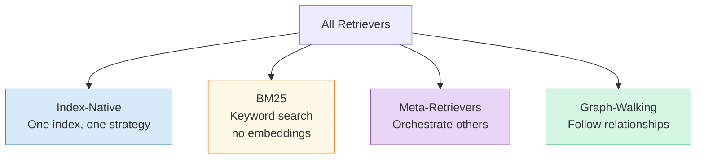
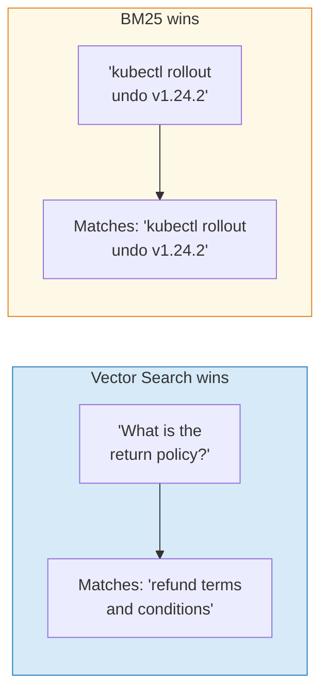
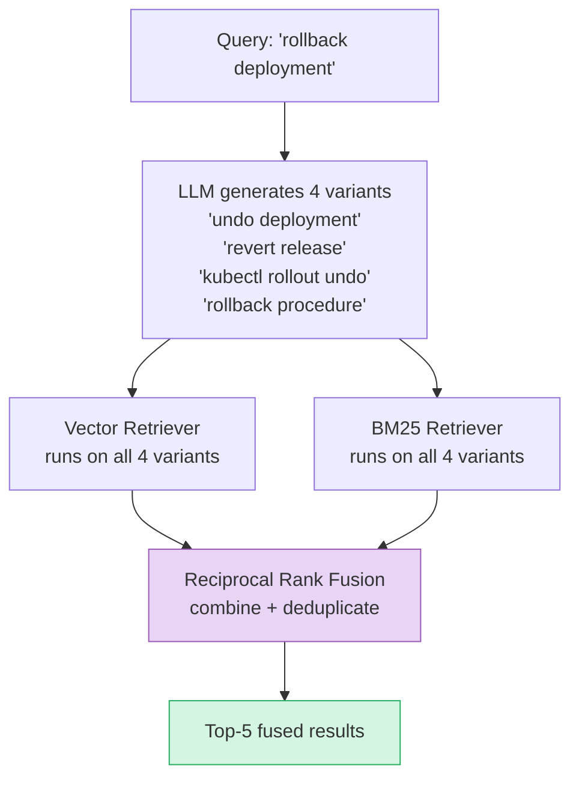
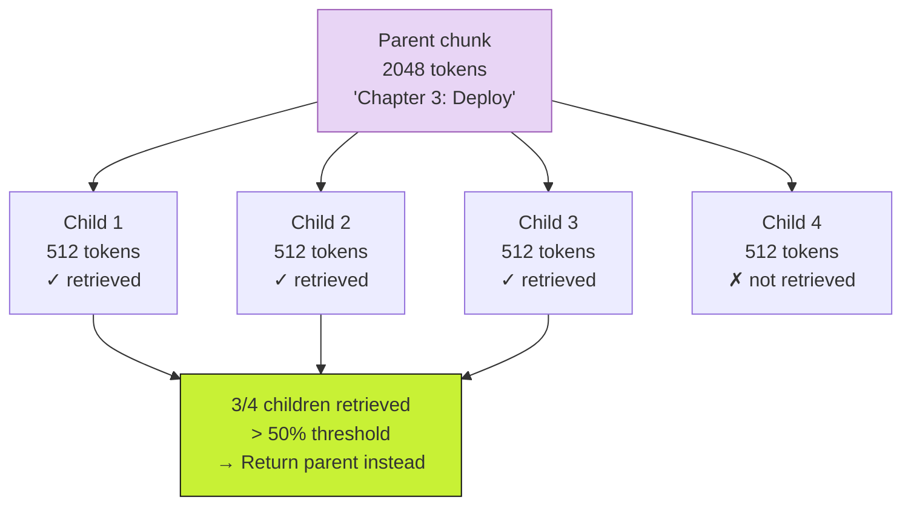
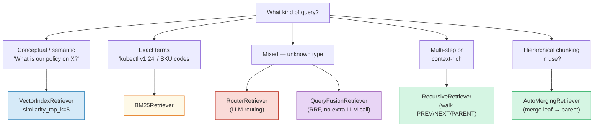

# Chapter 8: Choosing the Right Retriever

> **Series:** Building a Production RAG System with LlamaIndex
> **Usecase:** Your wiki has 50,000 pages. Some queries are conceptual ("what is our deployment philosophy"), some are exact ("find all mentions of kubectl v1.24"), some are multi-hop ("compare our staging and production rollback procedures"). The default retriever handles one of these well.

---

## The problem this chapter solves

The default `VectorIndexRetriever` with `similarity_top_k=2` is the "hello world" retriever. It works for demos. In production, retrieval quality is the single biggest lever on answer quality — more impactful than prompt engineering or model selection. Garbage retrieved, garbage answered.

The wrong retriever silently returns wrong results. No exception. No error. Just confident wrong answers.

This chapter covers every retriever in LlamaIndex, what each one is good at, and how to choose.

---

## The retriever contract

Every retriever in LlamaIndex implements one method:

```python
class BaseRetriever:
    def retrieve(self, query_bundle: QueryBundle) -> List[NodeWithScore]:
        ...

    async def aretrieve(self, query_bundle: QueryBundle) -> List[NodeWithScore]:
        ...
```

Takes a `QueryBundle` in, returns `List[NodeWithScore]` out. The query engine does not care how the nodes were found — vector search, keyword search, graph traversal. It just calls `.retrieve()`.

---

## The four categories of retrievers



---

## Category 1: Index-native retrievers

Each index type ships with its own default retriever strategy.

| Index | Default Retriever | Strategy |
|---|---|---|
| `VectorStoreIndex` | `VectorIndexRetriever` | Cosine similarity over embeddings |
| `SummaryIndex` | `SummaryIndexLLMRetriever` | LLM reads all nodes, picks relevant |
| `KeywordTableIndex` | `KeywordTableSimpleRetriever` | Keyword extraction + exact match |
| `DocumentSummaryIndex` | `DocumentSummaryIndexLLMRetriever` | Match query to per-doc summaries |

The key insight: **the retriever is not the index**. The index is built once at ingestion time. The retriever is a query-time strategy for searching it. A `VectorStoreIndex` can even be searched with a keyword-based strategy if needed.

### `VectorIndexRetriever` — the default

Embeds the query, computes cosine similarity against all stored vectors, returns top-k.

```python
retriever = VectorIndexRetriever(
    index=index,
    similarity_top_k=5,   # override the default of 2
)
```

When it wins: conceptual questions, paraphrased queries, synonyms. "What is the return policy?" correctly matches "refund terms and conditions."

When it loses: exact codes, version numbers, names, technical strings. "kubectl v1.24.2" embeds as a semantic blob — the model has no special understanding of version strings.

---

## Category 2: BM25Retriever — keyword search

BM25 (Best Match 25) is the algorithm that powers Elasticsearch, Solr, and most classic search engines. It scores documents by term frequency and inverse document frequency — pure statistics, no embeddings.

```python
from llama_index.retrievers.bm25 import BM25Retriever

# Build from nodes (same nodes your vector index uses)
bm25_retriever = BM25Retriever.from_defaults(
    nodes=nodes,
    similarity_top_k=5,
)

nodes = bm25_retriever.retrieve("kubectl rollout undo v1.24.2")
```

When BM25 wins: exact product codes (`SKU-4421-B`), CLI commands (`kubectl rollout undo`), version numbers (`Python 3.11`), proper names, legal citation numbers. These strings carry almost no semantic signal — a vector embedding of "kubectl v1.24.2" is not meaningfully close to anything. BM25 does exact token matching.

When BM25 loses: paraphrased questions, synonyms, conceptual queries. "What is the return window?" does not match "refund period is 30 days" with BM25.



---

## Category 3: Meta-retrievers

These do not search an index directly. They orchestrate other retrievers.

### `RouterRetriever` — LLM picks the retriever

The LLM reads the query, reads the descriptions of available retrievers, and picks the best one (or multiple).

```python
from llama_index.core.retrievers import RouterRetriever
from llama_index.core.tools import RetrieverTool

retriever_tools = [
    RetrieverTool.from_defaults(
        retriever=vector_retriever,
        description="Use for conceptual questions, paraphrased queries, and general knowledge about our processes."
    ),
    RetrieverTool.from_defaults(
        retriever=bm25_retriever,
        description="Use for exact terms, command names, version numbers, product codes, and proper names."
    ),
]

router = RouterRetriever.from_defaults(
    retriever_tools=retriever_tools,
    llm=llm,
    select_multi=True,  # can pick both if needed
)
```

Cost: one extra LLM call per query for routing. Latency: +200–400ms. Worth it when your corpus has genuinely mixed query types.

### `QueryFusionRetriever` — run multiple, fuse scores

Runs multiple retrievers in parallel, merges results using Reciprocal Rank Fusion (RRF). Also generates multiple rewritten versions of the query to improve recall.

```python
from llama_index.core.retrievers import QueryFusionRetriever

hybrid = QueryFusionRetriever(
    retrievers=[vector_retriever, bm25_retriever],
    similarity_top_k=5,
    num_queries=4,          # generate 4 query variants via LLM
    mode="reciprocal_rerank",  # RRF fusion
    use_async=True,
)
```

**How RRF works:** Each retriever returns a ranked list. A node's fused score is the sum of `1/(rank + 60)` across all lists. Nodes that rank consistently high across multiple queries and multiple retrievers bubble to the top.



No extra LLM call for routing — the fusion math handles it. This is the production default for most teams.

---

## Category 4: Graph-walking retrievers

These retrievers use the `relationships` dict we built in Chapter 2 (`SOURCE`, `PREV`, `NEXT`, `PARENT`, `CHILD`). They do not search by similarity — they traverse the graph.

### `RecursiveRetriever` — follow the links

Starts with top-level retrieval, then follows node relationships to fetch additional context.

```python
from llama_index.core.retrievers import RecursiveRetriever

retriever = RecursiveRetriever(
    root_id="root",
    retriever_dict={"root": vector_retriever},
    node_dict=all_nodes,
)
```

When retrieval finds chunk B, the `RecursiveRetriever` can:
- Walk `PREVIOUS` to include the chunk before it for context
- Walk `NEXT` to include the chunk after it
- Walk `PARENT` to include the broader section it belongs to

You get a richer context window without inflating `similarity_top_k`.

### `AutoMergingRetriever` — merge up the tree

Designed for hierarchical chunking (Chapter 3). When enough leaf-level chunks from the same parent are retrieved, it automatically returns the parent chunk instead.

```python
from llama_index.core.retrievers import AutoMergingRetriever

retriever = AutoMergingRetriever(
    vector_retriever,        # base retriever on leaf nodes
    storage_context,         # has access to all nodes including parents
    simple_ratio_thresh=0.5, # merge if >50% of sibling leaves retrieved
)
```

The logic: if 3 out of 4 child chunks of a parent all match a query, the parent contains all of them plus context. Return the parent, not 3 isolated fragments.



---

## The decision tree



---

## POC: run all three and compare scores

```python
from llama_index.core import VectorStoreIndex, Settings
from llama_index.core.retrievers import QueryFusionRetriever
from llama_index.retrievers.bm25 import BM25Retriever
from llama_index.embeddings.huggingface import HuggingFaceEmbedding

Settings.embed_model = HuggingFaceEmbedding(model_name="BAAI/bge-small-en-v1.5")

index = VectorStoreIndex.from_documents(documents)
nodes = [n for n in index.docstore.docs.values()]

vector_retriever = index.as_retriever(similarity_top_k=5)
bm25_retriever   = BM25Retriever.from_defaults(nodes=list(nodes), similarity_top_k=5)

query = "kubectl rollout undo v1.24.2"

# Compare side by side
print("=== Vector Search ===")
for n in vector_retriever.retrieve(query):
    print(f"  {n.score:.3f}  {n.node.text[:80]}...")

print("\n=== BM25 ===")
for n in bm25_retriever.retrieve(query):
    print(f"  {n.score:.3f}  {n.node.text[:80]}...")

# Hybrid via QueryFusionRetriever
hybrid = QueryFusionRetriever(
    retrievers=[vector_retriever, bm25_retriever],
    similarity_top_k=5,
    num_queries=1,       # disable query generation for POC
    mode="reciprocal_rerank",
)
print("\n=== Hybrid (RRF) ===")
for n in hybrid.retrieve(query):
    print(f"  {n.score:.3f}  {n.node.text[:80]}...")
```

Running this on your actual data before committing to a retriever strategy takes 10 minutes and prevents weeks of debugging wrong answers.

---

## Retriever trade-off table

| Retriever | Speed | Accuracy | Extra LLM? | Best for |
|---|---|---|---|---|
| `VectorIndexRetriever` | Fast | Semantic | No | Default, conceptual |
| `BM25Retriever` | Fastest | Keyword-exact | No | Codes, names, commands |
| `RouterRetriever` | Slow | Best adaptive | Yes (routing) | Known mixed query types |
| `QueryFusionRetriever` | Medium | Very good | Yes (rewriting) | Production default |
| `RecursiveRetriever` | Medium | Context-rich | No | Hierarchical docs |
| `AutoMergingRetriever` | Medium | Adaptive granularity | No | Hierarchical chunking |

---

## What's next

In Chapter 9 we zoom out from a single query to the ingestion system at scale — what breaks when you have 10 million documents, daily updates, and parallel workers, and how LlamaIndex's architecture handles each failure mode.

## Day One vs Production

| Concern | Day One | Production |
|---|---|---|
| Retriever | `VectorIndexRetriever`, top_k=2 | `QueryFusionRetriever`, top_k=10 |
| Search type | Semantic only | Hybrid: vector + BM25 |
| Query rewriting | None | LLM generates 4 variants |
| Fusion | None | Reciprocal Rank Fusion |
| Hierarchical | Flat chunks | `AutoMergingRetriever` |
| Index type | `VectorStoreIndex` only | Multiple indexes per domain |
| Routing | None | `RouterRetriever` for mixed corpora |
| Latency | Fast, single retrieval | Medium — parallel async retrieval |

