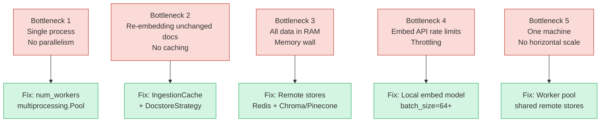
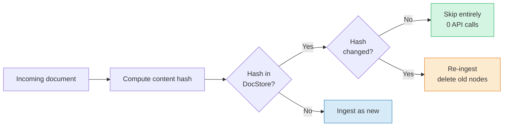
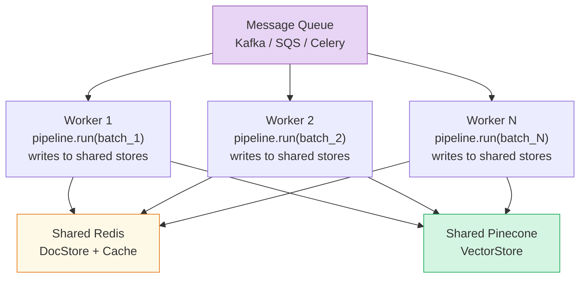

# Chapter 9: Scaling Ingestion to 10 Million Documents

> **Series:** Building a Production RAG System with LlamaIndex
> **Usecase:** Your company acquires two more companies. Your wiki grows from 50,000 pages to 10 million. Your daily ingestion job that ran in 8 minutes now takes 27 hours. This chapter is the five-step fix.

---

## The problem this chapter solves

Everything we built in Chapters 2–5 works correctly at small scale. The architecture is right. The abstractions are right. But five specific bottlenecks appear as you scale that will make the pipeline unusable without targeted fixes.

This chapter names each bottleneck, explains exactly why it appears, and shows the precise code change that fixes it. None of these require changing the pipeline structure — you are swapping backends, not rewriting logic.

---

## The five bottlenecks



---

## Bottleneck 1: Single process

### Why it appears

`pipeline.run()` with `num_workers=None` (the default) runs a single Python process. It processes documents one by one: load, split, embed, store, repeat. The embedding step calls an API (or a local model), waits for the response, then processes the next batch.

For 10 million documents averaging 5,000 words each, single-threaded at 200ms per embed batch:

```
10M docs × ~10 chunks/doc = 100M chunks
100M chunks ÷ 10 per batch = 10M API calls
10M calls × 200ms = 2,000,000 seconds = 23 days
```

### The fix: `num_workers`

```python
# Before — single process
nodes = pipeline.run(documents=documents)

# After — 4 OS processes, each handles 1/4 of the document list
nodes = pipeline.run(documents=documents, num_workers=4)

# Async version — overlaps API I/O waits within each process
nodes = await pipeline.arun(documents=documents, num_workers=4)
```

Internally, `num_workers` calls `multiprocessing.Pool(num_workers)` and uses `p.starmap(run_transformations, zip(node_batches, ...))`. Each process gets an equal slice of the node list and runs the full transformation chain independently.

Why `multiprocessing` and not `threading`? Python's GIL prevents true thread parallelism for CPU-bound work. Separate processes bypass the GIL. The tradeoff: higher memory overhead (each process loads the embed model) and inter-process serialization cost.

For API-based embed models (where work is I/O, not CPU), the async path (`arun`) is usually faster — it fires multiple HTTP requests concurrently within one process.

---

## Bottleneck 2: Re-embedding unchanged documents

### Why it appears

Without deduplication, every pipeline run re-processes every document — even if 99% are unchanged. On a 10M document corpus running daily:

- Day 1: embed 10M documents — takes hours, costs money
- Day 2: 1,000 documents updated — embed all 10M again — same cost

This is pure waste. The fix has two parts: a transformation cache and a document-level deduplication strategy.

### Fix part A: `IngestionCache` — skip unchanged chunks

```python
from llama_index.core.ingestion import IngestionCache
from llama_index.core.ingestion.cache import RedisCache

pipeline = IngestionPipeline(
    transformations=[SentenceSplitter(), embed_model],
    cache=IngestionCache(
        cache=RedisCache.from_host_and_port("localhost", 6379),
        collection="embed_cache",
    ),
)
```

Cache key = `hash(node_content + transformation_class + transformation_params)`. Same chunk, same model, same settings → cache hit, zero API call. The cache persists in Redis across restarts and deployments.

### Fix part B: `DocstoreStrategy` — skip unchanged documents

```python
from llama_index.core.ingestion import DocstoreStrategy
from llama_index.storage.docstore.redis import RedisDocumentStore

pipeline = IngestionPipeline(
    transformations=[SentenceSplitter(), embed_model],
    docstore=RedisDocumentStore.from_host_and_port("localhost", 6379),
    docstore_strategy=DocstoreStrategy.UPSERTS_AND_DELETE,
)
```

The docstore stores a hash of each document's content. On re-run, it compares the incoming document hash against the stored hash. If identical → skip entirely, before chunking. If different → re-ingest and delete old nodes from the vector store.



Combined result: a daily run on 10M docs where 1,000 changed takes ~30 seconds instead of hours.

---

## Bottleneck 3: Everything in memory

### Why it appears

`SimpleVectorStore` is a Python dict. `SimpleDocumentStore` is also in memory. At 10M nodes × 1536 floats × 4 bytes = **60GB** just for embeddings. Plus raw text in the docstore. A single machine cannot hold this, and it evaporates on every restart.

### The fix: swap every storage layer

The swap is configuration, not code. Every storage component implements a common interface — you change the backend without touching pipeline logic.

```python
# Day One — everything in RAM
pipeline = IngestionPipeline(
    transformations=[SentenceSplitter(), embed_model],
)
# Production — everything persistent and remote
from llama_index.storage.docstore.redis import RedisDocumentStore
from llama_index.vector_stores.pinecone import PineconeVectorStore
from pinecone import Pinecone, ServerlessSpec

pc = Pinecone(api_key="...")
pc.create_index("wiki", dimension=768, metric="cosine",
                spec=ServerlessSpec(cloud="aws", region="us-east-1"))

pipeline = IngestionPipeline(
    transformations=[SentenceSplitter(), embed_model],
    docstore=RedisDocumentStore.from_host_and_port("localhost", 6379),
    vector_store=PineconeVectorStore(pinecone_index=pc.Index("wiki")),
    cache=IngestionCache(cache=RedisCache.from_host_and_port("localhost", 6379)),
    docstore_strategy=DocstoreStrategy.UPSERTS_AND_DELETE,
)
```

The pipeline `.run()` call is identical. What changed: where things get stored and retrieved.

---

## Bottleneck 4: Embed API rate limits

### Why it appears

OpenAI's embedding API has rate limits: tokens per minute (TPM) and requests per minute (RPM). Hit the limit and the API returns `429 Too Many Requests`. Your pipeline stalls or crashes.

At `embed_batch_size=10` (the default), 100M chunks = 10M API calls. Even with concurrency, you will hit TPM limits.

### Fix A: Switch to a local embed model — no rate limit

```python
from llama_index.embeddings.huggingface import HuggingFaceEmbedding

# Runs on your own hardware — no API, no rate limit, no per-token cost
embed_model = HuggingFaceEmbedding(
    model_name="BAAI/bge-base-en-v1.5",
    embed_batch_size=64,   # 6x larger batch than OpenAI default
    device="cuda",         # GPU if available
)
```

### Fix B: Increase batch size for API models

```python
from llama_index.embeddings.openai import OpenAIEmbedding

embed_model = OpenAIEmbedding(
    model="text-embedding-3-small",
    embed_batch_size=100,  # OpenAI supports up to 2048 inputs per call
    # Fewer API calls = less rate limit pressure + lower latency
)
```

### Fix C: Async with retry

```python
# arun automatically retries on 429 and overlaps concurrent requests
nodes = await pipeline.arun(documents=documents, num_workers=4)
```

---

## Bottleneck 5: One machine, one pipeline process

### Why it appears

Even with `num_workers=8` you are limited to one machine's CPU cores. For 10M documents, even a 32-core machine with 8 workers takes 1–2 hours per run. If that machine restarts mid-run, you restart from scratch.

### The fix: distributed worker pool

The `IngestionPipeline` is **stateless** with respect to transformation work — each batch of documents is independent. This makes it naturally distributed.



```python
# worker.py — runs on each machine
from llama_index.core.ingestion import IngestionPipeline, DocstoreStrategy
# ... same pipeline setup as above ...

def process_batch(document_ids: List[str]):
    docs = fetch_documents_by_id(document_ids)  # your fetcher
    nodes = pipeline.run(documents=docs, num_workers=4)
    print(f"Worker processed {len(nodes)} nodes from {len(docs)} docs")

# orchestrator.py — splits work across workers
all_doc_ids = fetch_all_changed_document_ids()
batch_size  = 1000

for i in range(0, len(all_doc_ids), batch_size):
    batch = all_doc_ids[i:i+batch_size]
    celery_task.delay(batch)   # or SQS.send_message(batch)
```

The `UPSERTS_AND_DELETE` deduplication strategy ensures two workers processing the same document do not create duplicate embeddings — the docstore hash check is the single point of coordination.

---

## The full production pipeline

```python
from llama_index.core import Settings
from llama_index.core.ingestion import (
    IngestionPipeline, IngestionCache, DocstoreStrategy
)
from llama_index.core.ingestion.cache import RedisCache
from llama_index.core.node_parser import SentenceSplitter
from llama_index.embeddings.huggingface import HuggingFaceEmbedding
from llama_index.storage.docstore.redis import RedisDocumentStore
from llama_index.vector_stores.pinecone import PineconeVectorStore
from pinecone import Pinecone, ServerlessSpec

# 1. Explicit embed model — no surprise API fallbacks
Settings.embed_model = HuggingFaceEmbedding(
    model_name="BAAI/bge-base-en-v1.5",
    embed_batch_size=64,
    device="cpu",   # or "cuda" if GPU available
)

# 2. Persistent vector store
pc = Pinecone(api_key="YOUR_KEY")
vector_store = PineconeVectorStore(pinecone_index=pc.Index("company-wiki"))

# 3. Pipeline with all five bottlenecks addressed
pipeline = IngestionPipeline(
    transformations=[
        SentenceSplitter(chunk_size=512, chunk_overlap=50),
        Settings.embed_model,
    ],
    docstore=RedisDocumentStore.from_host_and_port(
        "localhost", 6379, namespace="wiki_docs"
    ),
    vector_store=vector_store,
    cache=IngestionCache(
        cache=RedisCache.from_host_and_port("localhost", 6379),
        collection="wiki_embed_cache",
    ),
    docstore_strategy=DocstoreStrategy.UPSERTS_AND_DELETE,
)

# 4. Run — parallel, cached, deduplicated
changed_docs = fetch_changed_since_last_run()
nodes = pipeline.run(documents=changed_docs, num_workers=4)
print(f"Ingested {len(nodes)} nodes from {len(changed_docs)} changed documents")
```

---

## Day One vs Production at a glance

| Concern | Day One | Production (10M docs) |
|---|---|---|
| Parallelism | Single process | `num_workers=4+`, `arun()` |
| Embed model | OpenAI fallback, batch=10 | Local BAAI/bge, batch=64 |
| Vector store | `SimpleVectorStore` (RAM) | Pinecone / Weaviate / pgvector |
| Doc store | `SimpleDocumentStore` (RAM) | Redis / MongoDB |
| Cache | None | `IngestionCache` + Redis |
| Deduplication | None | `UPSERTS_AND_DELETE` |
| Horizontal scale | 1 machine | Worker pool + message queue |
| Cost per daily run | Re-embeds everything | Embeds only changed chunks |
| Failure recovery | Restart from scratch | Resume from last checkpoint |

---

## What's next

In Chapter 10 we wire up observability — how to trace every LLM call, token count, retrieval decision, and latency across the full pipeline. When your RAG system returns a wrong answer, observability is the difference between finding the bug in 5 minutes and guessing for 3 days.
