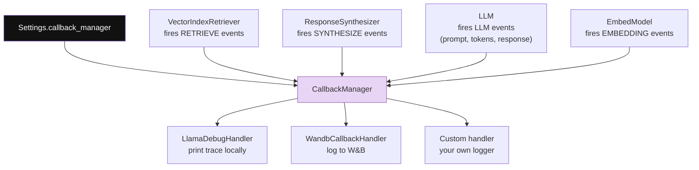
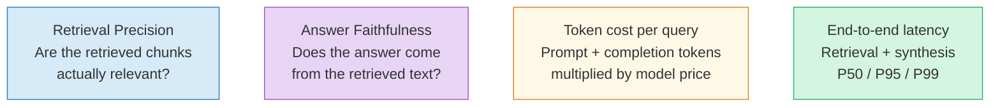

# Chapter 10: Observability — Seeing Inside the Black Box

> **Series:** Building a Production RAG System with LlamaIndex
> **Usecase:** An engineer reports that your RAG system gave a confidently wrong answer about the rollback procedure. You have no idea whether the retriever found the wrong chunks, the LLM hallucinated, or the prompt template was too short. This chapter is how you find out.

---

## The problem this chapter solves

A RAG pipeline is a black box by default. You put a question in, an answer comes out. If the answer is wrong, you have no idea where in the pipeline it went wrong:

- Did the retriever return the wrong chunks?
- Were the right chunks there but scored too low and filtered out?
- Did the LLM ignore the context and answer from training data?
- Did the prompt template truncate the context?
- Did a metadata extraction step add noise that confused the embedding?

Without observability, debugging means guessing. With observability, you have an event trace of every decision, latency, and token count across the full pipeline.

---

## The observability architecture

LlamaIndex instruments everything through a single `CallbackManager` that lives on the `Settings` singleton. Every component — retrievers, synthesizers, LLMs, embed models — fires events through this manager. You attach handlers that receive those events.



---

## The event types

LlamaIndex fires events at the start and end of every major operation:

| Event | Fires when | Contains |
|---|---|---|
| `RETRIEVE` | Retriever called | query string, returned nodes, scores |
| `SYNTHESIZE` | Synthesizer called | query, context string, response |
| `LLM` | LLM API call made | full prompt, completion, token counts |
| `EMBEDDING` | Embed model called | text batch, resulting vectors |
| `CHUNKING` | NodeParser called | input text, output chunks |
| `NODE_PARSING` | Transformation runs | input nodes, output nodes |
| `QUERY` | Full query started/ended | end-to-end latency |

Each event has a start (`CBEventType.XXX`) and end (`EventType.XXX_END`) so you can measure latency of any component independently.

---

## Tool 1: `LlamaDebugHandler` — local development

The simplest handler. Collects all events in memory and prints a trace at the end of each query. Zero configuration.

```python
from llama_index.core import Settings, VectorStoreIndex, SimpleDirectoryReader
from llama_index.core.callbacks import CallbackManager, LlamaDebugHandler

# Wire up the debug handler
debug_handler = LlamaDebugHandler(print_trace_on_end=True)
Settings.callback_manager = CallbackManager([debug_handler])

# Build index and query — all events are now captured
documents = SimpleDirectoryReader("./docs").load_data()
index     = VectorStoreIndex.from_documents(documents)
engine    = index.as_query_engine()

response = engine.query("How do I roll back a deployment?")
```

Output:

```
**********
Trace: query
    |_query ->  2.14 seconds
      |_retrieve ->  0.31 seconds
        |_embedding ->  0.18 seconds
      |_synthesize ->  1.82 seconds
        |_llm ->  1.74 seconds
**********
```

You can also query the events programmatically:

```python
# See all events
events = debug_handler.get_events()
for e in events:
    print(f"{e.event_type.value:20s}  {e.id_}")

# Get the LLM call — inspect the full prompt
llm_events = debug_handler.get_llm_inputs_outputs()
for e in llm_events:
    print("=== PROMPT ===")
    print(e.inputs["messages"])
    print("=== RESPONSE ===")
    print(e.outputs["response"])
    print(f"Tokens: {e.outputs.get('total_tokens', '?')}")
```

---

## Tool 2: Token counting — measure cost

The `TokenCountingHandler` tracks every token used across all LLM and embed calls.

```python
import tiktoken
from llama_index.core.callbacks import CallbackManager, TokenCountingHandler

token_counter = TokenCountingHandler(
    tokenizer=tiktoken.encoding_for_model("gpt-4o-mini").encode,
    verbose=True,
)
Settings.callback_manager = CallbackManager([token_counter])

# Run a query
response = engine.query("How do I roll back a deployment?")

# Read the counts
print(f"LLM prompt tokens:     {token_counter.prompt_llm_token_count}")
print(f"LLM completion tokens: {token_counter.completion_llm_token_count}")
print(f"Embed tokens total:    {token_counter.total_embedding_token_count}")
print(f"Total LLM tokens:      {token_counter.total_llm_token_count}")
```

Use this to benchmark your prompt template and synthesis mode choices before running at production scale. A `REFINE` synthesis mode might use 5x more tokens than `COMPACT` for the same query.

---

## Tool 3: Custom handler — log to your stack

For production, you want events in your existing logging infrastructure (Datadog, Grafana, CloudWatch). Write a handler that emits structured logs or metrics:

```python
import json, time
import logging
from llama_index.core.callbacks import BaseCallbackHandler, CBEventType
from typing import Any, Dict, List, Optional

logger = logging.getLogger("rag.trace")

class StructuredLogHandler(BaseCallbackHandler):
    def __init__(self):
        super().__init__([], [])   # no filtered events

    def on_event_start(self, event_type: CBEventType,
                       payload: Optional[Dict] = None, **kwargs) -> str:
        self._start_times[kwargs.get('event_id','')] = time.time()
        return ""

    def on_event_end(self, event_type: CBEventType,
                     payload: Optional[Dict] = None,
                     event_id: str = "", **kwargs) -> None:
        latency = time.time() - self._start_times.pop(event_id, time.time())
        log = {
            "event":   event_type.value,
            "latency": round(latency, 3),
        }
        if event_type == CBEventType.RETRIEVE and payload:
            nodes = payload.get("nodes", [])
            log["num_nodes"]   = len(nodes)
            log["top_score"]   = nodes[0].score if nodes else 0
            log["bottom_score"] = nodes[-1].score if nodes else 0
        if event_type == CBEventType.LLM and payload:
            log["prompt_tokens"]     = payload.get("prompt_token_count", 0)
            log["completion_tokens"] = payload.get("completion_token_count", 0)
        logger.info(json.dumps(log))

    def start_trace(self, trace_id: Optional[str] = None) -> None: pass
    def end_trace(self, trace_id: Optional[str] = None,
                  trace_map: Optional[Dict] = None) -> None: pass

Settings.callback_manager = CallbackManager([StructuredLogHandler()])
```

This emits JSON log lines that any log aggregator can ingest and dashboard.

---

## The four metrics that matter

Once you have event data, these are the metrics that tell you whether your RAG system is healthy:



**Retrieval precision:** Check `response.source_nodes`. Are the retrieved chunks actually about the query topic? If top scores are consistently below 0.7, your embed model or chunk size needs tuning.

**Answer faithfulness:** Does the answer use language from the source chunks? LLM hallucinations appear as claims in the answer not supported by any retrieved chunk. Tools like `DeepEval` and `Ragas` automate this check.

**Token cost:** `prompt_llm_token_count` × model price. A `COMPACT` synthesizer with `similarity_top_k=5` on `gpt-4o-mini` should cost well under $0.001 per query.

**End-to-end latency:** The debug trace shows `retrieve` and `synthesize` latencies separately. Retrieval above 100ms points to a slow vector store. Synthesis above 2s points to a large prompt or slow model.

---

## POC: full trace on a single query

```python
from llama_index.core import VectorStoreIndex, SimpleDirectoryReader, Settings
from llama_index.core.callbacks import (
    CallbackManager, LlamaDebugHandler, TokenCountingHandler
)
from llama_index.embeddings.huggingface import HuggingFaceEmbedding
from llama_index.llms.openai import OpenAI
import tiktoken

# Wire everything up
debug   = LlamaDebugHandler(print_trace_on_end=False)
counter = TokenCountingHandler(
    tokenizer=tiktoken.encoding_for_model("gpt-4o-mini").encode
)
Settings.callback_manager = CallbackManager([debug, counter])
Settings.embed_model = HuggingFaceEmbedding(model_name="BAAI/bge-small-en-v1.5")
Settings.llm = OpenAI(model="gpt-4o-mini")

# Build and query
documents = SimpleDirectoryReader("./docs").load_data()
index     = VectorStoreIndex.from_documents(documents)
engine    = index.as_query_engine(similarity_top_k=5)
response  = engine.query("How do I roll back a deployment?")

# Print the trace
print("=== Answer ===")
print(response.response)

print("\n=== Retrieved Chunks ===")
for n in response.source_nodes:
    print(f"  score={n.score:.4f}  {n.node.text[:100]}...")

print("\n=== Latency ===")
events = debug.get_events()
for e in events:
    if hasattr(e, 'time') and e.time:
        print(f"  {e.event_type.value:25s}  {e.time:.3f}s")

print("\n=== Token Cost ===")
print(f"  Prompt:     {counter.prompt_llm_token_count} tokens")
print(f"  Completion: {counter.completion_llm_token_count} tokens")
print(f"  Embed:      {counter.total_embedding_token_count} tokens")
```

---

## Production observability checklist

Before launching to production, verify all of these are instrumented:

```
□ Retrieval: log num_nodes, top_score, bottom_score per query
□ Latency: log retrieve_ms and synthesize_ms per query
□ Tokens: log prompt + completion tokens per query
□ Errors: log any retrieval or LLM exceptions with query context
□ Feedback: log thumbs-up/down from engineers to build eval set
□ Weekly audit: sample 50 queries, check source_nodes manually
```

The weekly manual audit catches silent failures that metrics miss — the cases where scores look fine but the retrieved chunks are technically about the right topic but the wrong version of a procedure.

---

## What's next

In the final chapter, Chapter 11, we add agents — the ability for LlamaIndex to answer multi-step questions that require multiple retrievals, tool calls, and reasoning steps. When a single query-and-synthesize is not enough, agents take over.

## Day One vs Production

| Concern | Day One | Production |
|---|---|---|
| Handler | `LlamaDebugHandler` — prints to stdout | `StructuredLogHandler` → JSON → Datadog / Grafana |
| Token tracking | None | `TokenCountingHandler` on every query |
| Latency tracking | Read from debug trace manually | Emit `retrieve_ms` + `synthesize_ms` as metrics |
| Retrieval audit | Inspect `response.source_nodes` manually | Log `top_score`, `bottom_score`, `num_nodes` per query |
| Error tracking | Exception stack trace | Structured error log with query context |
| Sampling | All queries | 100% logging + sampled deep traces |
| Feedback loop | None | Thumbs up/down → labelled eval set |

