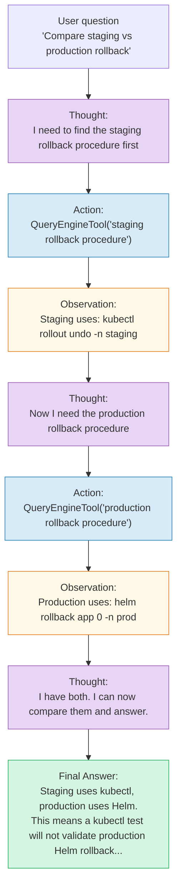
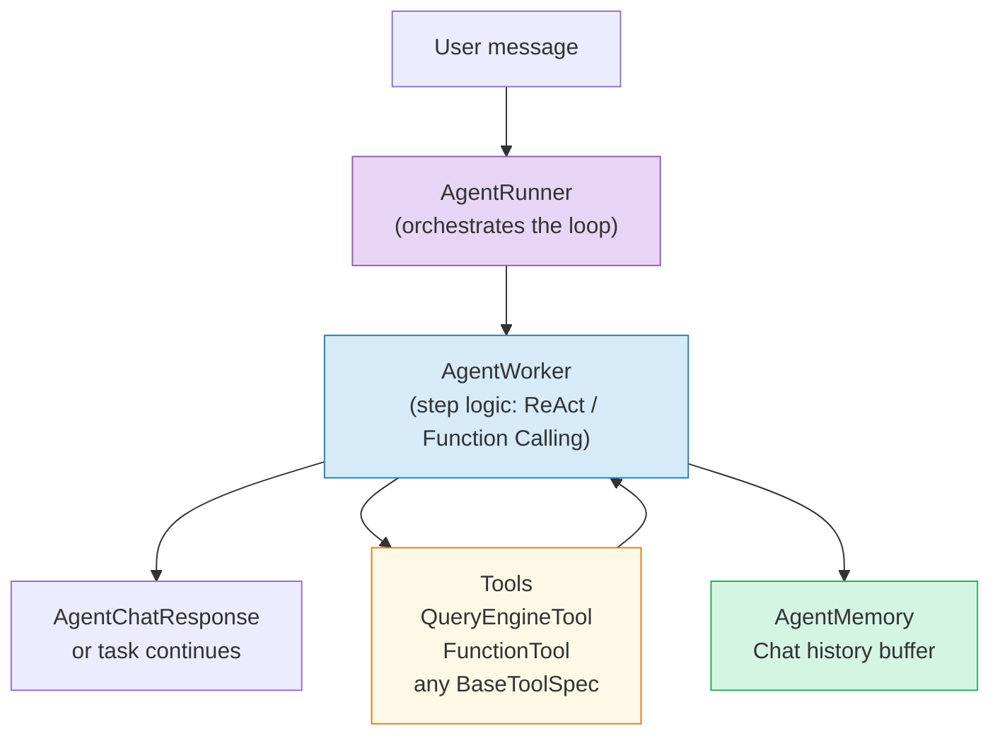
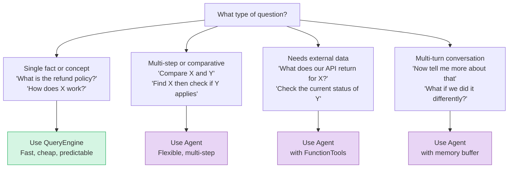

# Chapter 11: Agents — When One Retrieval Is Not Enough

> **Series:** Building a Production RAG System with LlamaIndex
> **Usecase:** An engineer asks: "Compare the rollback procedure in staging with the one in production, and tell me if there are any differences that could cause the staging test to pass but production to fail." A single query engine cannot answer this. An agent can.

---

## The problem this chapter solves

The query engine in Chapter 7 handles one pattern: retrieve → synthesize → answer. That pattern covers 80% of RAG queries. But some questions require more:

- **Multi-step:** "First find the staging rollback procedure, then find the production one, then compare them."
- **Tool use:** "Look up the rollback procedure AND check the current Kubernetes version from our API."
- **Conditional:** "If our deployment uses Helm, use the Helm rollback guide. If not, use the kubectl guide."
- **Iterative:** "Keep retrieving until you have enough context to answer with confidence."

None of these fit the single retrieve-synthesize loop. What you need is a **reasoning loop** — a system that decides what to do next at each step, based on what it has learned so far. That is an agent.

---

## The ReAct loop — the core of every agent

Every LlamaIndex agent is built on the ReAct (Reasoning + Acting) pattern. The agent alternates between thinking and doing until it reaches a final answer.



Each iteration is one **step**. The agent keeps stepping until the LLM decides it has enough to answer. The maximum number of steps is configurable — the safeguard against infinite loops.

---

## The AgentRunner architecture



`AgentRunner` manages the task lifecycle — it keeps track of completed steps, active tasks, and memory. `AgentWorker` implements the step logic — for ReAct agents this means parsing the LLM's Thought/Action/Observation format; for function-calling agents it means processing OpenAI-style tool call outputs.

---

## `QueryEngineTool` — wrapping your index as a tool

The bridge between agents and RAG is `QueryEngineTool`. It wraps any `QueryEngine` as a tool the agent can call. The tool description tells the LLM when to use it.

```python
from llama_index.core.tools import QueryEngineTool

staging_tool = QueryEngineTool.from_defaults(
    query_engine=staging_engine,
    name="staging_docs",
    description=(
        "Use this tool to search the staging environment documentation. "
        "Covers staging deployment, rollback, monitoring, and configuration. "
        "Use for any question about staging-specific procedures."
    ),
)

production_tool = QueryEngineTool.from_defaults(
    query_engine=production_engine,
    name="production_docs",
    description=(
        "Use this tool to search the production environment documentation. "
        "Covers production deployment, rollback, incident response, and runbooks. "
        "Use for any question about production-specific procedures."
    ),
)
```

The description is the most important field. The LLM reads it to decide which tool to call. Be specific about what the tool covers and when to use it.

---

## Building a multi-index agent

```python
from llama_index.core import VectorStoreIndex, SimpleDirectoryReader, Settings
from llama_index.core.agent import ReActAgent
from llama_index.core.tools import QueryEngineTool, FunctionTool
from llama_index.embeddings.huggingface import HuggingFaceEmbedding
from llama_index.llms.openai import OpenAI

Settings.embed_model = HuggingFaceEmbedding(model_name="BAAI/bge-small-en-v1.5")
Settings.llm = OpenAI(model="gpt-4o-mini")

# Build separate indexes for each knowledge domain
staging_docs    = SimpleDirectoryReader("./docs/staging").load_data()
production_docs = SimpleDirectoryReader("./docs/production").load_data()

staging_index    = VectorStoreIndex.from_documents(staging_docs)
production_index = VectorStoreIndex.from_documents(production_docs)

# Wrap as tools with descriptive names
tools = [
    QueryEngineTool.from_defaults(
        query_engine=staging_index.as_query_engine(similarity_top_k=5),
        name="staging_docs",
        description="Staging environment docs: deployment, rollback, config.",
    ),
    QueryEngineTool.from_defaults(
        query_engine=production_index.as_query_engine(similarity_top_k=5),
        name="production_docs",
        description="Production docs: deployment, rollback, incident runbooks.",
    ),
]

# Build the agent
agent = ReActAgent.from_tools(
    tools=tools,
    llm=Settings.llm,
    verbose=True,        # print each Thought/Action/Observation step
    max_iterations=10,   # safeguard — stop after 10 steps
)

# Ask a multi-step question
response = agent.chat(
    "Compare the rollback procedure in staging vs production. "
    "Are there any differences that could cause staging tests to pass "
    "but production rollback to fail?"
)
print(response.response)
```

With `verbose=True`, you see every reasoning step printed as the agent works through the problem. This is the most valuable debugging tool for agents.

---

## Adding custom function tools

Agents are not limited to RAG tools. You can give the agent any Python function as a tool:

```python
from llama_index.core.tools import FunctionTool
import requests

def get_current_k8s_version(cluster: str) -> str:
    """Get the current Kubernetes version running in a cluster.
    Use this when you need to check the actual K8s version before
    giving rollback instructions that are version-specific.
    """
    resp = requests.get(f"https://k8s-api.internal/clusters/{cluster}/version")
    return resp.json()["version"]

k8s_tool = FunctionTool.from_defaults(fn=get_current_k8s_version)

agent = ReActAgent.from_tools(
    tools=[staging_tool, production_tool, k8s_tool],
    llm=Settings.llm,
    verbose=True,
)
```

The LLM reads the function's docstring as the tool description. Write clear docstrings that explain when to use the tool.

---

## Memory: conversation across turns

By default, `AgentRunner` maintains a chat history buffer. Multi-turn conversations work out of the box:

```python
# Turn 1
response1 = agent.chat("What is the staging rollback procedure?")
print(response1.response)

# Turn 2 — the agent remembers the context from turn 1
response2 = agent.chat("Now compare that with production.")
print(response2.response)

# Turn 3 — still has context
response3 = agent.chat("Which one is safer for a Friday deploy?")
print(response3.response)
```

The memory buffer is configurable. For long sessions where context grows too large for the LLM's window, use a summarising memory:

```python
from llama_index.core.memory import ChatSummaryMemoryBuffer

agent = ReActAgent.from_tools(
    tools=tools,
    llm=Settings.llm,
    memory=ChatSummaryMemoryBuffer.from_defaults(token_limit=4096),
)
```

The summary buffer keeps a compressed summary of older turns instead of the raw text, staying within the context window limit.

---

## When to use an agent vs a query engine



Agents are not always better than query engines. They are slower (multiple LLM calls), more expensive (tokens multiply with steps), and harder to debug. Use a query engine for well-defined single-step questions. Use an agent when the question genuinely requires multiple steps or tools.

---

## POC: inspect every agent step

```python
from llama_index.core.callbacks import CallbackManager, LlamaDebugHandler
from llama_index.core import Settings

debug = LlamaDebugHandler(print_trace_on_end=True)
Settings.callback_manager = CallbackManager([debug])

agent = ReActAgent.from_tools(tools=tools, llm=Settings.llm, verbose=True)
response = agent.chat("Compare staging and production rollback procedures")

# Get step-by-step trace
task = agent.create_task("Compare staging and production rollback procedures")
step_output = agent.run_step(task.task_id)

while not step_output.is_done:
    print(f"\n--- Step {step_output.output.current_reasoning[-1]} ---")
    step_output = agent.run_step(task.task_id)

final = agent.finalize_response(task.task_id)
print(f"\nFinal: {final.response}")
```

Running step-by-step (instead of `agent.chat()`) lets you inspect exactly what the agent decided at each iteration — which tool it chose, what query it passed, what the tool returned, and how that changed its next thought.

---

## The cost trade-off

| | QueryEngine | ReActAgent (avg 3 steps) |
|---|---|---|
| LLM calls | 1 | 3–5 |
| Retrieval calls | 1 | 1 per step = 3–5 |
| Latency | 1–2s | 5–15s |
| Token cost | ~500 tokens | ~2,000–5,000 tokens |
| Best for | Known single-step queries | Open-ended multi-step questions |

Gate agent usage behind query complexity detection. Simple questions with keywords like "what", "how", "define" → query engine. Complex questions with "compare", "find all", "given X then Y" → agent.

---

## Where to go from here

You have now built the full system — from reading a single `.txt` file in Chapter 1 to a production-scale, observable, agent-powered RAG system in Chapter 11.

The system handles 10 million documents (Chapter 9), searches them semantically and by keyword (Chapter 8), synthesizes grounded answers (Chapter 7), traces every decision (Chapter 10), and reasons through multi-step questions (this chapter).

The next areas to explore from here: **evaluation** (Ragas, DeepEval — measure retrieval precision and answer faithfulness automatically), **fine-tuning your embed model** on your domain's vocabulary, and **structured outputs** (getting the LLM to return JSON instead of prose for downstream processing).

The code for every chapter is in the GitHub repository. Each chapter's POC section runs independently — start with Chapter 1 and build up, or jump to the chapter that solves your current production problem.

## Day One vs Production

| Concern | Day One | Production |
|---|---|---|
| Agent type | `ReActAgent` with `verbose=True` | `ReActAgent` with structured logging |
| Tools | 1–2 `QueryEngineTool` wrappers | Multiple tools: RAG + `FunctionTool` for APIs |
| Memory | Default `ChatMemoryBuffer` | `ChatSummaryMemoryBuffer` with token limit |
| max_iterations | 10 (default) | 5–8 (tighter budget) |
| Async | Sync `.chat()` | Async `.achat()` for concurrent sessions |
| Error handling | Exception propagates | Catch `MaxIterationsError`, fallback to QueryEngine |
| Cost control | Unbounded | Gate on query complexity — simple → QueryEngine |
| Observability | `verbose=True` print statements | `CallbackManager` with structured log handler |

## What's next

This is the final chapter of the series. You have built the full system — from reading a single `.txt` file in Chapter 1 to a production-scale, observable, agent-powered RAG system here in Chapter 11.

The natural next steps from here:

**Evaluation** — Use [Ragas](https://github.com/explodinggradients/ragas) or [DeepEval](https://github.com/confident-ai/deepeval) to measure retrieval precision and answer faithfulness automatically. Build a labelled eval set from engineer feedback (Chapter 10's thumbs up/down).

**Embed model fine-tuning** — Fine-tune `BAAI/bge-base` on your domain's vocabulary using LlamaIndex's `EmbeddingAdapterFinetuneEngine`. A fine-tuned model on your company's specific terminology consistently outperforms the base model by 5–15% on retrieval precision.

**Structured outputs** — Use `StructuredPredictor` to get JSON back instead of prose — useful when the RAG system feeds a downstream API or UI component that needs machine-readable output.

The full code for every chapter lives in the [GitHub repository](https://github.com/dhanush-ctrl-ai/llamaindex-rag-blog-series). Each chapter's POC section runs independently.

